# Config

## Introduction

### Overview

First, the **administrative section** allows us to get an overview pertaining to the **users**, the **user groups (or profile)**, the
available **sources** and the **type of sources** authorized for different profiles.

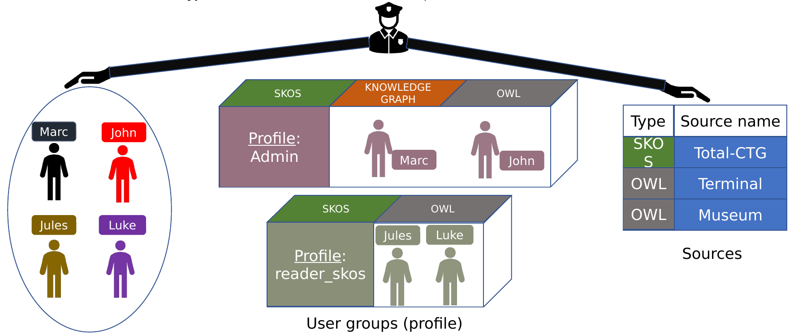

### Users

In addition, this section gives us the license to **add/delete users**.

### Users groups

We can assign/remove a user to/from a **newly created group or not**.

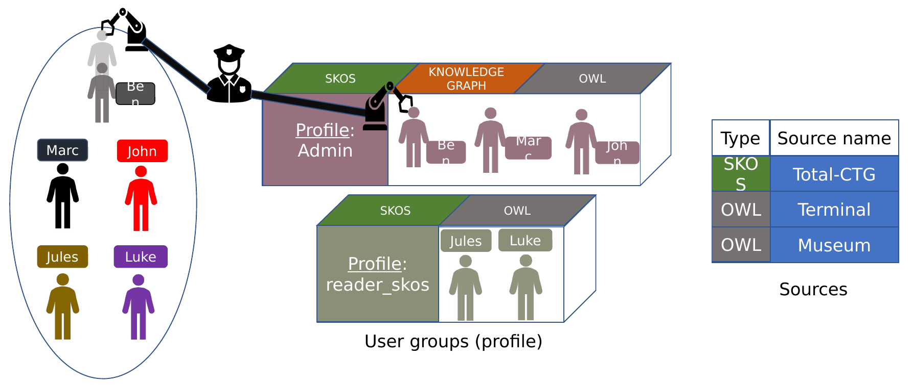

### Sources

Finally, it is possible to **create new sources** or **delete** existing ones.

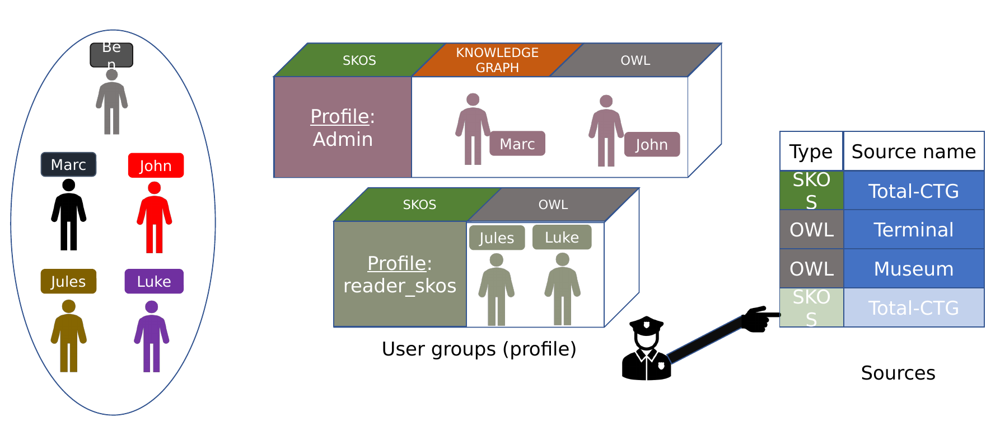

## Application

### User creation

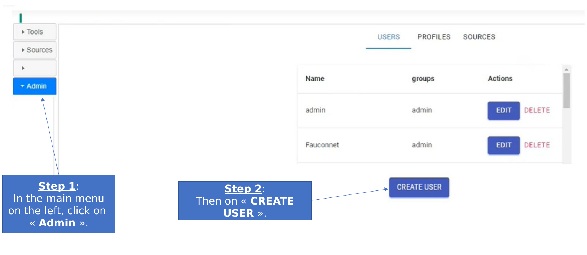

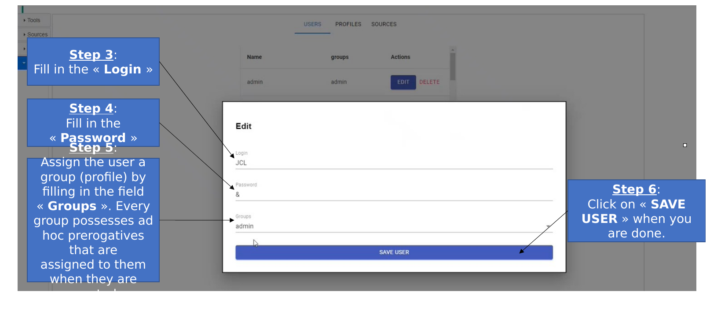

### User credentials' modification

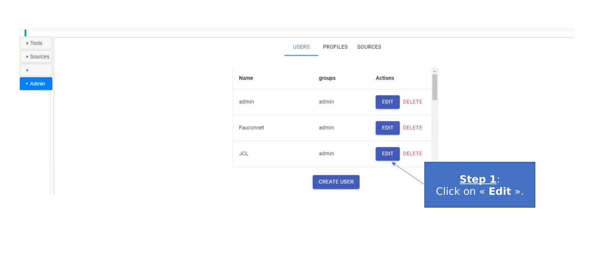

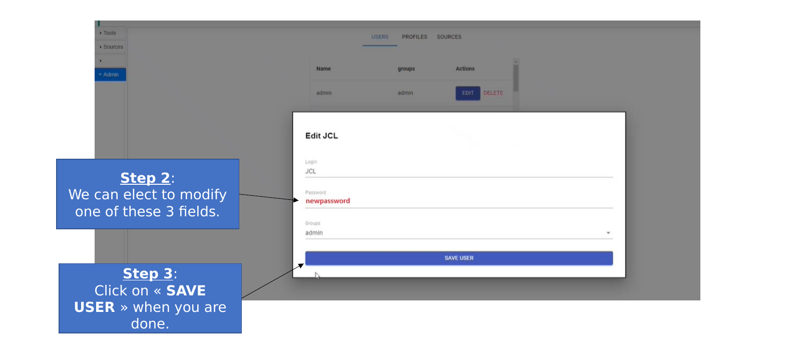

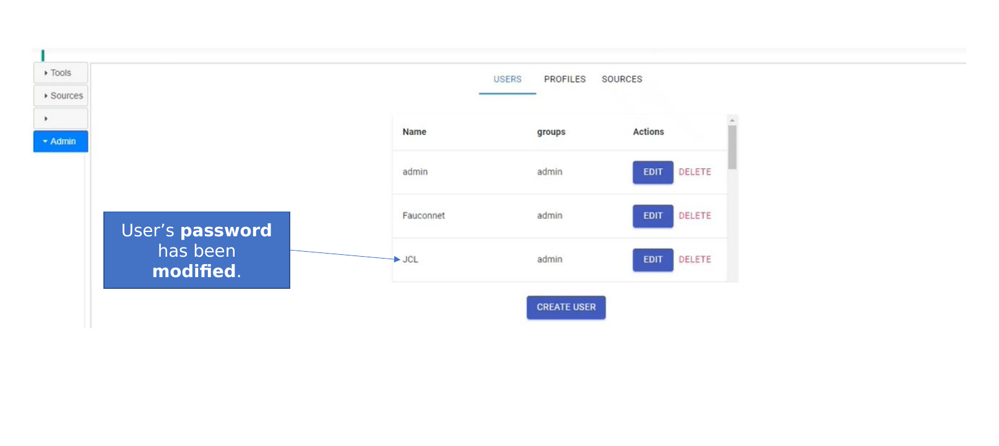

### User removal

### Sources' repository management

We can **categorize sources** pertaining to their respective **types** (OWL, SKOS…) and store them in ad hoc **repositories**.

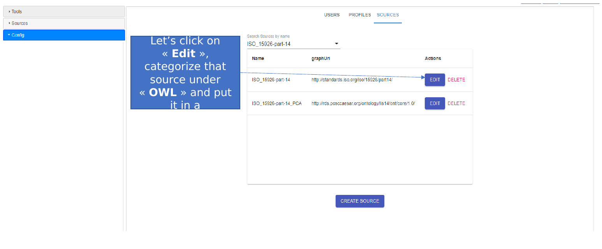

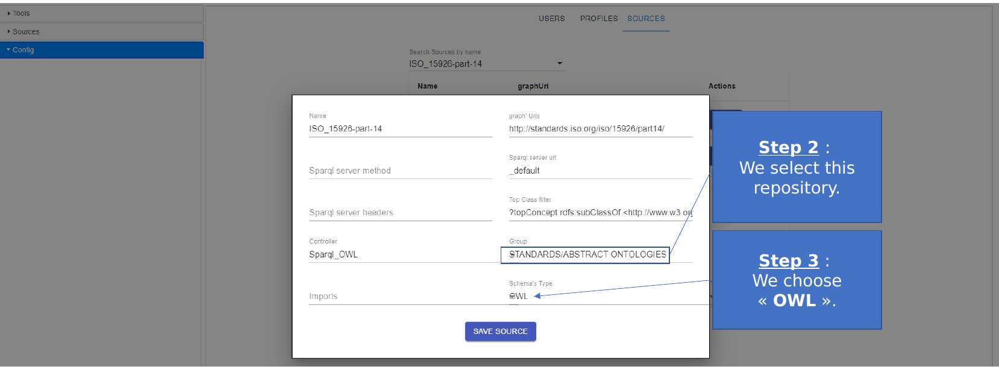

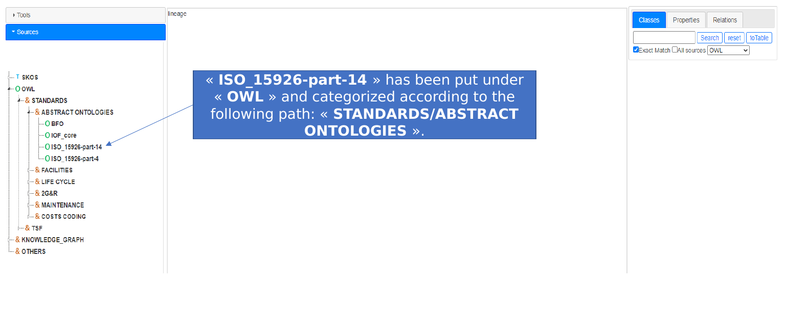
