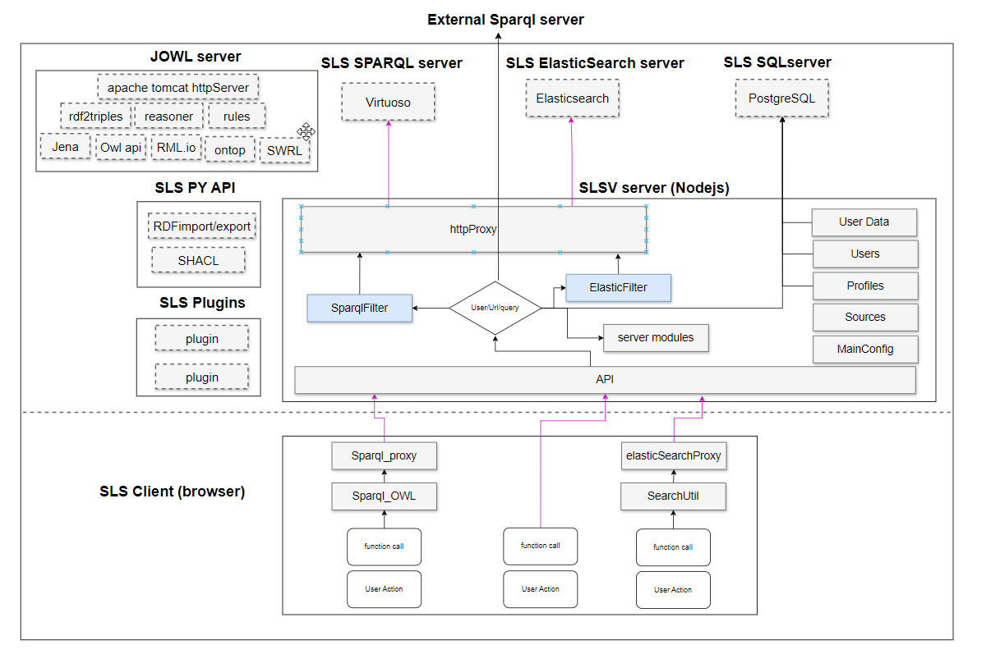

# Architecture

SousLeSens is built around microservices that communicate with each other.

## Overview

## Client

The SousLeSens client is build with Javascript.

## Server

### Node server and API

The SousLeSens server is build with Javascript with [express](https://expressjs.com/)
server.

### Dependencies

SousLeSens depedencies are databases, triplesstore

- ElasticSeach: to store data indices for fast searching
- Postgresql: to store users and profiles
- Virtuoso: to store RDF graphs

### Optional tools

- [JOWL](https://github.com/souslesens/jowl): adds API routes that use Jena library.
- [sls-py-api](https://github.com/souslesens/sls-py-api): adds API routes that use RDFlib.
