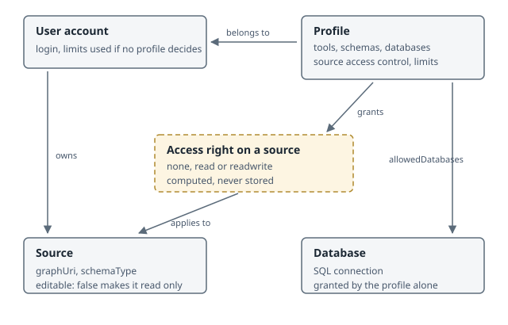

# Access rights and quotas

This page describes who may write where, how much a user is allowed to hold, and how
those figures are computed. It records the decisions behind the implementation, not only
the fields to fill in.

## The resources involved

Five resources decide everything on this page. Three are stored, one is a plain
configuration file, and the access right itself is computed rather than stored.

- A **user account** belongs to the profiles listed on it, owns sources, and carries
  limits used only where no profile decides.
- A **profile** grants tools, schema types, databases and source access to the accounts
  that belong to it. Its limits win over those of the account.
- A **source** is a descriptor pointing at a named graph in the triplestore. Its
  `editable` flag can make it read-only for everyone but the administrators.
- The **access right on a source** is derived from ownership, the profiles, the `editable`
  flag and the `admin` group, every time it is needed. Nothing stores it, which is why
  changing a profile takes effect immediately.
- A **database** is an SQL connection the Mapping Modeler reads rows from. Access to it
  comes from the profile alone: no source points at a database, the tool is what brings
  the two together at import time.
- **User data** entries belong to a user and are capped by their own limit. The same table
  also stores the technical records of the triple accounting, owned by the admin account
  so they never weigh on anybody's allowance.

## Access Rights and Quotas Matrix

The columns are the five situations a user can be in for a given source. They are read
from left to right: being an administrator settles everything, then owning the source,
then what the profiles grant. The last column overrides all the others but the first: a
source declared with `"editable": false` in `sources.json` is read-only for everyone
except the administrators, its owner included.

| Operation                                         | Administrator | Owner of the source | `readwrite` profile | `read` profile | Source `editable: false` | Quota                           |
| ------------------------------------------------- | ------------- | ------------------- | ------------------- | -------------- | ------------------------ | --------------------------------------------- |
| Read a source (Lineage, KGquery, SPARQL `SELECT`) | yes | yes | yes | yes | yes | none                                          |
| Mapping Modeler : write triples                    | yes | yes | yes | no | no | `maxWritableTriplesPerUser`                   |
| Mapping Modeler : delete triples                   | yes | yes | yes | no | no | none, it frees quota                          |
| Graph Management : upload a graph                  | yes | yes | yes | no | no | `maxUploadTriplesPerUser`                     |
| Graph Management : delete or clear a graph         | yes | yes | yes | no | no | none, it frees quota                          |
| SPARQL : update,insert                 | yes | yes | yes | no | no | none                                          |
| Mapping Modeler : N-Triples export                                  | yes | yes | yes | yes | yes | `maxNtExportTriples`, per export              |
| Create a source                                   | yes | not related          | depends on profile's `allowSourceCreation` | depends on profile's `allowSourceCreation` | not related               | `allowSourceCreation`, `maxNumberCreatedSource` |
| Save a user data entry                            | yes | not related          | yes | yes | not related               | `maxUserDataRecordsPerUser`                   |

These two operations are not attached to a source, so the "owner of the source" and
`editable: false` columns do not apply, marked "not related". They depend only on the
user's own rights: `readwrite`/`read` cells report whether the profile grants the
underlying flag (`allowSourceCreation` for source creation; every profile can save user
data entries, subject only to the quota).

A few points the table cannot carry:

- **Administrators are exempt from two limits only**, source creation and the N-Triples
  export, which both test the `admin` group explicitly. The three triple and user data
  limits have no such exemption: they apply to an administrator whose account or profile
  sets them. In practice an administrator is uncapped because nobody sets them there.
- **A SPARQL `INSERT` is subject to no triple quota.** The proxy checks the write right
  per graph and stops there. Such triples belong to nobody, and the accounting explicitly
  refuses to charge triples nobody recorded, so they inflate no one's usage.
- **An export is capped per call, not per stock.** Beyond the cap the export is truncated
  and carries a notice saying so, rather than being refused.
- **Deleting frees quota immediately**, because the usage is measured against the store
  rather than accumulated in a counter.
- `maxNtExportTriples` is read from the profiles only, never from the user account,
  unlike the four others.

## Access rights on a source

Three things decide whether a user may read or write a source.

**The profiles.** Each profile carries a `sourcesAccessControl` map whose keys are paths
of the form `<schemaType>/<group>/<sourceName>`, and whose values are `read` or
`readwrite`. A key is a prefix: `OWL/FOLDER_1` covers every OWL source of that folder,
and the longest matching key wins. A user holding several profiles keeps the most
permissive result.

**The ownership.** A user always holds `readwrite` on the sources they own.

**The `editable` flag of the source.** A source declared with `"editable": false` in
`sources.json` is read-only for everyone but the administrators, whatever the profiles or
the ownership grant. This is the rule to use to protect reference ontologies such as BFO
that every profile needs to read and nobody should modify.

Administrators, meaning the `admin` login or any member of the `admin` group, hold every
right on every source, and are the only ones who may write a graph that no source
declares.

These three rules are settled in one place, `SourceModel._getAllowedSources`, which
attaches an `accessControl` value to each source of a user. Every consumer inherits from
it: the API routes that write, the SPARQL proxy that filters `INSERT`, `DELETE`, `LOAD`
and `CLEAR` per graph, and the tools that grey out what cannot be written.

A write route asks `sourceModel.canWrite(user, {name})` or
`sourceModel.canWrite(user, {graphUri})` and answers `403` when the answer is no. The
graph form exists for the routes that only know a graph URI, such as clearing a graph.

## The five limits

| Limit                       | What it caps                                                   |
| --------------------------- | -------------------------------------------------------------- |
| `allowSourceCreation`       | Whether the user may create a source at all                     |
| `maxNumberCreatedSource`    | How many sources the user may own                               |
| `maxWritableTriplesPerUser` | Triples the user holds through the Mapping Modeler              |
| `maxUploadTriplesPerUser`   | Triples the user holds through a graph upload                   |
| `maxUserDataRecordsPerUser` | User data entries the user owns                                 |

They exist both on the profile and on the user account, and are set from the Config
Editor: the *Limitations* drawer of a profile, and the corresponding fields of a user.

`maxNtExportTriples` is a sixth limit of a different nature: it caps a single N-Triples
export rather than a stock, so there is nothing to accumulate against it.

### How a limit is resolved

A profile that sets a limit takes precedence over the account, so an offer tier can lower
the defaults stored on the accounts. When several profiles set the same limit, the most
permissive wins. A limit left undefined on the profile falls back to the account, and a
limit undefined on both sides caps nothing: an instance that never configured any of this
behaves exactly as it did before.

Zero is a value, not an absence: it forbids. This is why the fields are validated as
nonnegative rather than positive, and why the resolution uses `??` and never `||`.

## Counting the triples a user holds

Nothing in the triplestore says who wrote a triple. Triples are inserted bare, an upload
loads an opaque file, and the response of an `INSERT` reports the volume submitted rather
than the volume stored. Virtuoso answers `N (or less) triples -- done` even when every
triple was already present. A user's stock therefore cannot be recomputed by asking the
store who owns what.

What the store can answer is how big a **bucket** is, right now:

- Mapping Modeler: the triples of a graph carrying `KGcreator#mappingFile "<table>"`,
  which is exactly the grain the deletion works at.
- Upload: everything else in the graph, that grain having no marker at all.

Beside each bucket we record, per user, the **share** they poured in, measured as the
difference between two live measurements taken around their write. Usage is the sum of
their shares, scaled down when the live measurement is smaller, which is what a deletion
looks like, whichever path it took, including a hand-written SPARQL `DELETE` that no
application hook could ever catch.

That scaling is written back into the shares as soon as it is observed. A share that
still claimed more than the bucket holds would be a debt waiting to be revived: the next
person writing into that bucket grows the live measurement, the scaling relaxes, and
everyone's usage climbs back to what it was before the deletion.

Consequences worth knowing:

- Replaying a mapping someone else already ran measures a delta of zero, so it costs the
  second runner nothing. The store deduplicates; we observe it.
- A deletion is charged to the contributors of the bucket in proportion to their shares,
  regardless of who deleted and of who had written the deleted triples. On a bucket with
  a single contributor, which is the common case, the figure is exact.
- Emptying a bucket drops every share it held.
- The upload bucket also collects what the Lineage tool writes, meaning axioms, relations
  and decorations, for want of a marker on those.

The share records live in the `user_data` table, owned by the admin account, which keeps
them out of every other user's listing and out of reach of their deletions. They are read
and written directly rather than through `userDataModel`, whose listing is scoped to the
calling user and whose content may be stored outside the database.

## How a limit is enforced

**Before the write.** A route refuses with `403` and an explicit message when the user has
already reached the cap. A cap of `0` refuses without measuring anything.

**During the write.** An import cannot be judged beforehand: the rows are read by batches
and the triples are produced and written as it goes, so the volume it will produce is
unknown until it is produced. The route therefore hands the writer the triples still
allowed, and the writer checks that budget before each batch. The overrun is bounded by
one batch rather than by the size of the table, and the user is told the import was cut
short.

The budget is spent with what each batch submits, which overstates the cost whenever the
store already held those triples. When it looks exhausted it is refilled once from the
live usage before giving up, so that replaying an existing mapping remains free.

**After the write.** The share is credited with the measured difference, never with the
count reported by the triplestore.

## What the user sees

The *Quotas* tab of the user settings shows, for each limit that has a usage, what the
user currently holds and the cap resolved for them. The triple figures are measured
against the triplestore when the page is opened, so a deletion made outside the
application is already taken into account.
