# Admin tool

The Admin tool gathers maintenance operations on sources: search index, ontology model cache, graphs, export of class sheets, annotation property templates and activity log. This page describes its main actions.

```{contents} Table of Contents
:depth: 2
```

## Access and interface

Open the tool from the **Tool** menu, entry **admin**. It only appears when it is enabled among the available tools of the instance and allowed in the profile of the user: see the Settings and Profiles sections of the [ConfigEditor](configeditor.md).

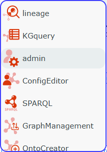

The panel shows the action buttons at the top and the source tree at the bottom. Actions apply to the sources checked in the tree, which the **Search** field filters.

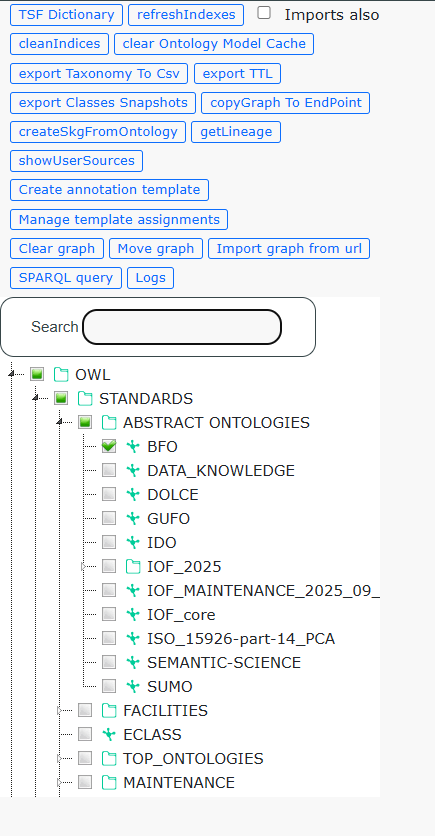

| Button                          | Sources to check           | Purpose                                    |
| ------------------------------- | -------------------------- | ------------------------------------------ |
| **refreshIndexes**              | one or more                | Rebuild the search index                   |
| **cleanIndices**                | none                       | Delete the indices without a source        |
| **clear Ontology Model Cache**  | one                        | Reload the ontology model                  |
| **export Classes Snapshots**    | one                        | Export one HTML sheet per class            |
| **Create annotation template**  | none or one                | Create an annotation property template     |
| **Manage template assignments** | none, or the ones to show  | Assign templates                           |
| **Clear graph**                 | one                        | Empty the graph of a source                |
| **Move graph**                  | one                        | Move the graph of a source to another URI  |
| **Logs**                        | none                       | Read the activity log                      |

The other buttons of the panel are not described here: they serve specific uses or duplicate other tools.

(admin-search-index)=

## Search index

Each source has an Elasticsearch index, named after the source in lowercase. Label search relies on it, for example the search bar of Lineage. Lineage automatically indexes a source that was never indexed when it opens it. Reindex a source when its graph changes outside SousLeSens, or to index extra predicates. In the [ConfigEditor](configeditor.md), the **Data** column of the source list flags a missing index.

### Rebuild the index

1. Check the sources to reindex. Also check **Imports also** to reindex the imports of each source.
2. Click **refreshIndexes** and confirm.

    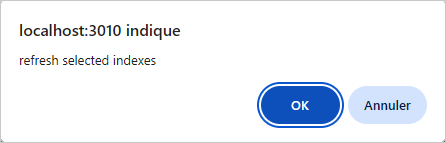

3. Answer the question about individuals: **OK** also indexes the individuals, that is the resources of the source graph typed by an OWL class. **Cancel** skips them, which speeds up the indexation of a source with many individuals.

    

4. For each checked source, the **Indexed predicates** bot offers two choices:
    - **Default predicates** only indexes the default predicates, `rdfs:label`, `skos:prefLabel` and `skos:altLabel`.
    - **Default predicates + other indexable predicates** also lists the indexable predicates of the source.

    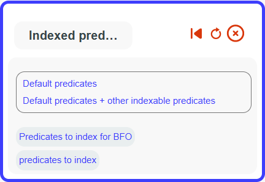

5. In the second case, check the wanted predicates under **Other predicates**, then click **Validate**. Validating with nothing checked falls back to the default predicates.

    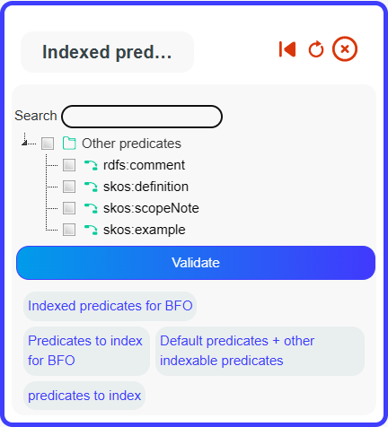

The indexation then runs source by source. The message bar shows the progress, then **ALL DONE**.

The index holds the classes with their parents, the object properties and, when asked, the individuals. The values of the chosen predicates are added to the alternative labels of the documents: search finds them like a `skos:altLabel`. The choice only applies to the current indexation. The next reindex asks again, and the automatic indexation of a new source only uses the default predicates.

In Lineage, the **Refresh indexes** entry of a source menu does the same for the active source, individuals included.

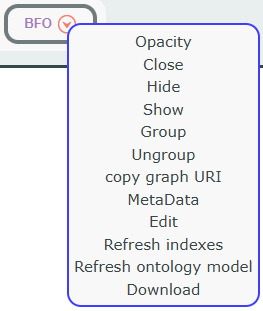

### Offered predicates

A predicate appears under **Other predicates** when it meets all the following conditions:

1. **It is declared** `owl:DatatypeProperty`, `owl:AnnotationProperty` or `rdf:Property` in the graph of the source, of one of its imports or of a basic vocabulary: rdf, rdfs, owl, skos, dcterms, dc and iof-av.
2. **It is not also declared** `owl:ObjectProperty`.
3. **It is not already indexed by default**: `rdfs:label`, `skos:prefLabel` and `skos:altLabel` are left out.
4. **It is not a technical predicate**: `rdf:type`, `dcterms:created`, `dcterms:creator` and `dcterms:source` are never offered.
5. **Its range allows text.** A predicate whose declared `rdfs:range` values are all non-text types is left out. These types are the XSD numeric types, `xsd:boolean`, `xsd:date`, `xsd:dateTime`, `xsd:time` and `xsd:anyURI`. A predicate without a declared range stays a candidate.
6. **It carries at least one text value** in the graph of the source or of its imports: a literal that is neither numeric nor of one of the types above. A literal without a datatype qualifies.

If an expected predicate does not appear:

- **Check its declaration.** A predicate used in the data but never declared is not offered. Declare it, for example as `owl:AnnotationProperty`.
- **Refresh the ontology model.** Declarations are read from the model cache. A declaration added since then only shows up after a {ref}`refresh of the model <admin-ontology-model-cache>` of the source that holds it.
- **Check its range.** A range declared as numeric or date leaves the predicate out, even when the data contains text.
- **Check its values.** A predicate without any text value in the source or its imports is not offered.

### Clean the indices

With no source checked, **cleanIndices** lists the Elasticsearch indices that match no declared source, comparing the names in lowercase. Indices whose name starts with a dot are ignored. A confirmation shows the number of indices and their names, then **OK** deletes them. This frees the space of the indices left behind by deleted sources.

> **Warning**: every index of the Elasticsearch server without a matching source is deleted, including the index of another application sharing that server. Read the list before confirming.

(admin-ontology-model-cache)=

## Ontology model cache

The server keeps a model of each source in cache: classes, properties, domains and ranges. The tools use it, for example for the class and property lists of the bots. Its content and computation are detailed in the {ref}`developer documentation <ontology-model>`.

**clear Ontology Model Cache** empties this cache for the checked source, then rebuilds its model from the triplestore. When several sources are checked, only the first one is processed. The **DONE** message signals the end.

Refresh the model:

- after loading a graph with GraphManagement, or after a change to the graph made outside SousLeSens;
- when a recent class or property is missing from the lists;
- before reindexing a source whose predicate declaration has just changed.

In Lineage, the **Refresh ontology model** entry of the same source menu does the same. A full reindex, from **refreshIndexes** or **Refresh indexes**, also refreshes the model of the source at the end of the indexation.

## Graphs

Both actions require write access to the graphs involved. They change the triplestore and cannot be undone: download a copy of the graph first, for example from [GraphManagement](../usage/graphmanagement.md).

### Clear a graph

1. Check a single source.
2. Click **Clear graph**.
3. Confirm twice. The first confirmation recalls the source and the URI of its graph.

    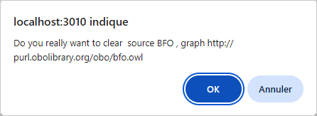

All the triples of the source graph are deleted. The source stays declared and its search index is not changed. The quota shares recorded on this graph are reset: see [Access rights and quotas](rights-and-quotas.md).

> **Warning**: clearing is permanent.

### Move a graph

Moving a graph changes its URI, for example to go from a temporary URI to the final URI of an ontology.

1. Check a single source.
2. Click **Move graph**.
3. Enter the URI of the target graph.

    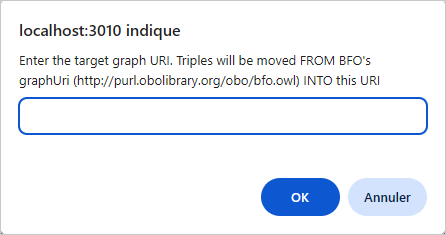

4. Confirm twice. The first confirmation recalls the original URI and the target URI.

    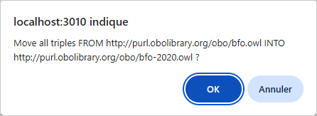

The operation:

- **moves the triples** in batches to the target graph, and the original graph ends up empty. Triples already in the target graph are kept.
- **rewrites the URIs** of the target graph, as subject, predicate and object. The old graph URI becomes the new one, and so does the beginning of every URI built on it. A URI that ends neither with `/` nor with `#` gets a `/` appended for this comparison.
- **updates the source**: its `graphUri` takes the new URI. Its `baseUri` takes it too, ending with a `/`, when it was empty or equal to the old URI.
- **refreshes the ontology model** of the source.

Only the moved graph is rewritten: other graphs that cite the old URIs do not change. The search index also keeps the old URIs: {ref}`rebuild the index <admin-search-index>` after the move.

> **Warning**: the move empties the original graph.

## Export of class sheets

**export Classes Snapshots** produces, for each class of the checked source, an HTML copy of the information tab of the Lineage Node Infos panel. The server opens each class in a headless browser, and a progress bar shows next to the message bar. At the end, the browser downloads the `<source>_snapshots.zip` archive.

Conditions:

- **A source already opened**: the server reads the class list from the ontology model cache. Open the source in a tool first.
- **500 classes at most**: a larger source is refused.
- **Administrators only.**

Classes that fail are listed in the `_failures.json` file of the archive. The archive stays available on the server for ten minutes and can only be downloaded once.

The server needs a Chromium for Playwright. The Docker image provides it, with the `PLAYWRIGHT_CHROMIUM_EXECUTABLE_PATH` variable. Outside Docker, install the browser expected by the `playwright` package of the server, from the root of the repository. The `npx playwright` command of the repository runs another version, the one of `@playwright/test`, which would install another browser.

```bash
node node_modules/playwright/cli.js install chromium
```

The browser opens SousLeSens on `http://127.0.0.1` and the listening port of the server. When it runs on another machine, the `SNAPSHOTS_BASE_URL` variable gives the address to open.

## Annotation property templates

A template is a list of annotation properties. When a user creates a resource with the **Add resource** button of [Lineage](../usage/lineage.md), each property of the applicable templates is added to the resource with the value `?`, to be filled in later. The applicable templates are those assigned to the source, to the user and to each of their profiles.

### Create a template

1. Check a source to offer its vocabularies and those of its imports, or check none for a general template.
2. Click **Create annotation template**, then **Choose property**.
3. Choose a vocabulary. With no source checked, the list offers BFO, dc, dcterms, iof-av, rdf, rdfs, owl and skos. **Search Property** searches all vocabularies at once.

    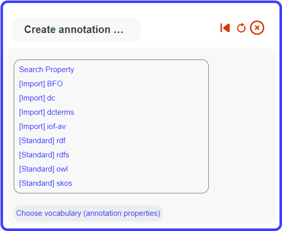

4. Choose an annotation property. The field above the list filters it.

    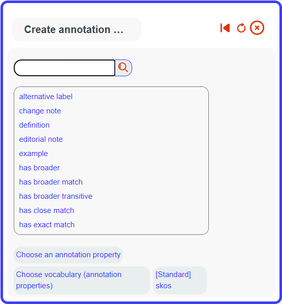

5. Choose **Add another property** to add another property, or **Save template** to save.

    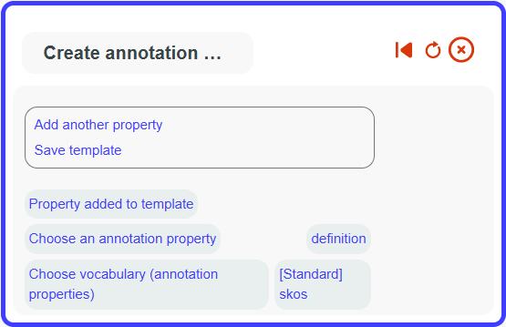

6. Fill in **Label**, **Group** and **Description**, then click **Save new**.

    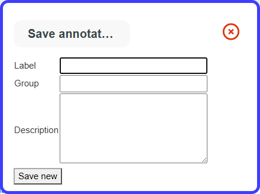

After saving, **Create another template** starts a new template and **End** closes the bot.

### Assign templates

**Manage template assignments** opens the table of active assignments. When sources are checked, only their assignments are shown.

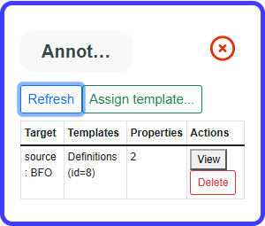

Each row gives the target, the assigned templates and their number of properties. **View** details the properties, **Delete** removes the assignment, **Refresh** reloads the table.

To assign a template:

1. Click **Assign template...** and choose the template. The bot then offers **Apply**, **Delete template**, **Back** and **Cancel**.

    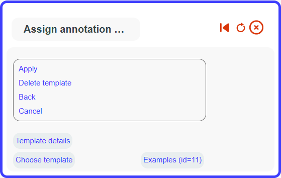

2. Choose **Apply**, then the target type: **Profile**, **User** or **Source**.

    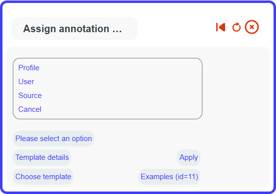

3. Choose the target. For a profile or a user, the bot shows the sources involved.
4. Confirm with **Apply**.

    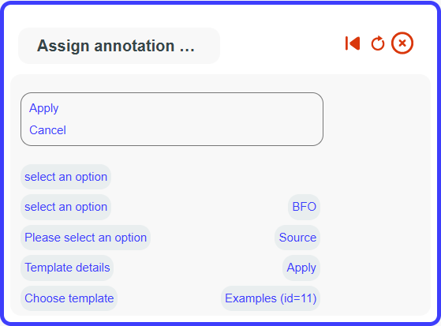

A target has only one active assignment. When it already has a template, the bot offers to keep it, replace it, add the new one next to it, or remove the existing one.

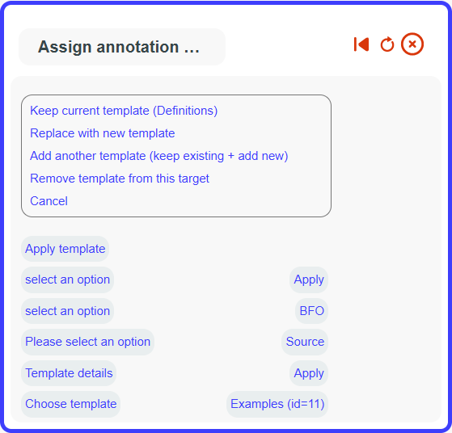

After choosing a template, **Delete template** deletes it. The recommended option, **Unassign & delete**, removes its assignments first.

## Activity log

**Logs** opens the activity log in a dialog. It is the same table as the Logs tab of the [ConfigEditor](configeditor.md).
