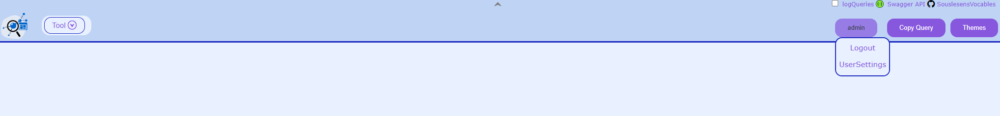
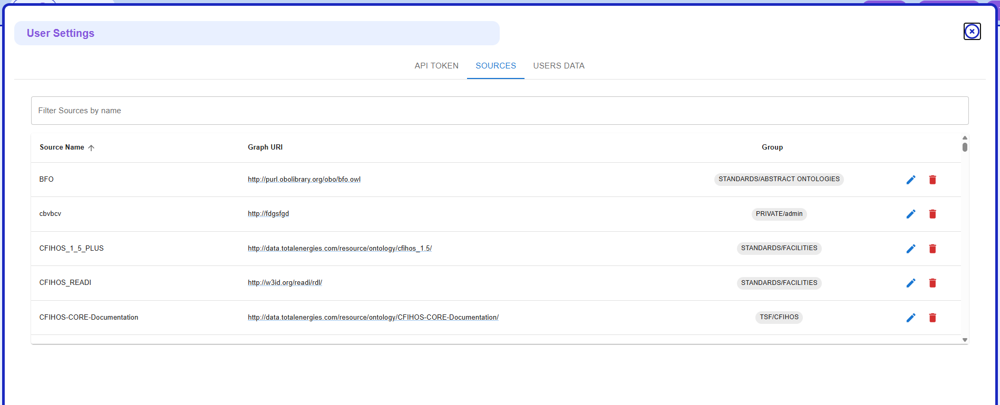
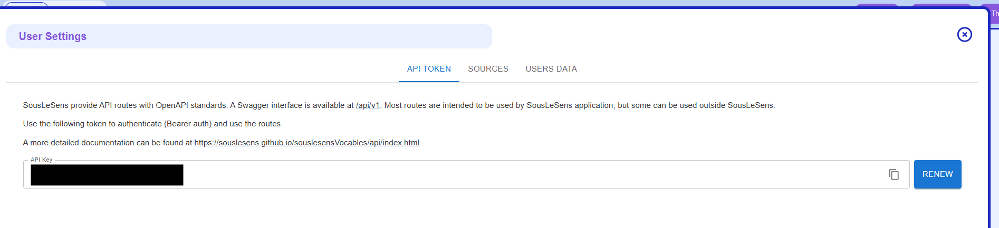

# API

SousLeSens provide API routes with [OpenAPI](https://swagger.io/specification/) standards.
A [Swagger](https://swagger.io/) interface is available at `/api/v1`.

Most routes are intended to be used by SousLeSens application, but some can be used outside
SousLeSens. The following documentation describle routes that can be used outised SousLeSens.
For other routes, refer to the OpenAPI documentation available on the Swagger interface.

Authentication via a bearer token is required to use the routes. Token is available via the
_UserSettings_ tool.

## Getting a Bearer Token

To generate or copy your bearer token:

1. Open the user menu in the top-right corner and click **UserSettings**.

   

2. In the **User Settings** dialog, select the **API TOKEN** tab.

   

3. Copy the current token from the **API Key** field, or click **RENEW** to generate a new one.

   

```shell
curl --header "authorization: Bearer xxx" http://sls.example.org/api/v1/users/me
```

```{toctree}
:maxdepth: 3
ai.md
userdata.md
```
