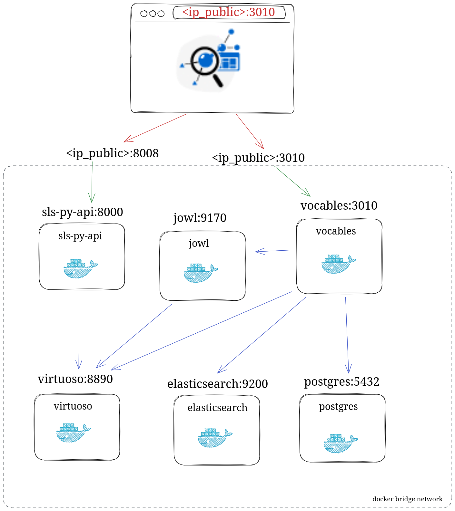

# Docker architecture

When sls is depolyed with `docker`, microservices communicate between them through a
docker bridge network (defined at the end of the `docker-compose.yml` file.)

Each services can communicate with each other using containers names (blue arrows).

Port mappings are used to communicate to the services outside the docker network (red and green arrows).

## Ressources

- Container networking: [docs.docker.com/engine/network](https://docs.docker.com/engine/network/)
