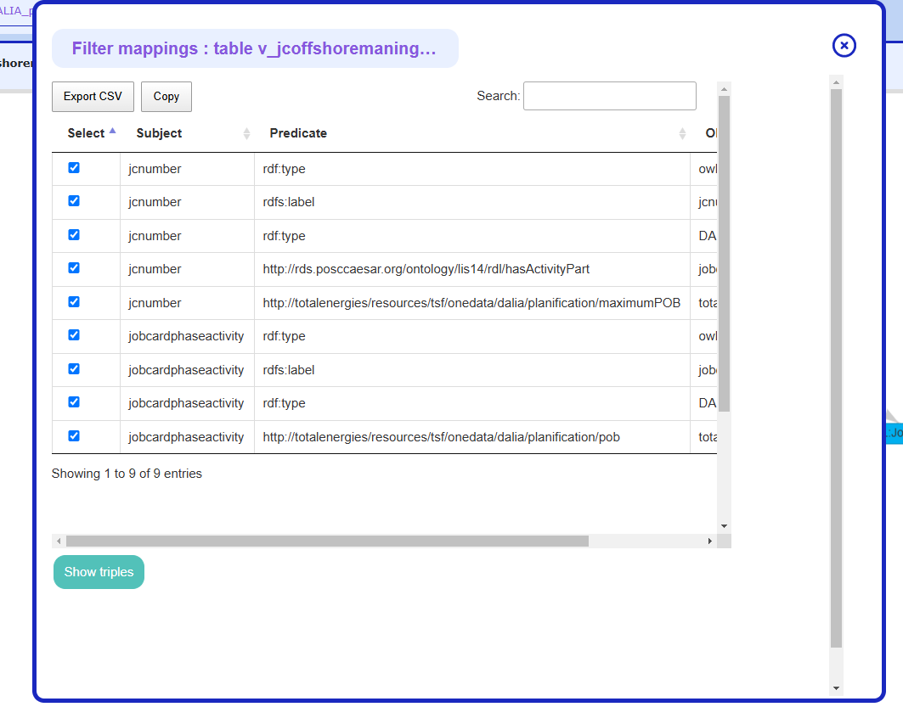

# Code Documentation

## Mapping Modeler

### filterMappings

We can on a mapping, use the button 'show Sample Triples' to have a preview of the Triples that will be generated by the mapping done or generating the triples by button 'Create triples'

Both buttons calls the function MappingDetails.showFilterMappingDialog that will show a Dialog with all mappings on a jquery Datatable they are all checked by default, but the user can select a subset of the mapping only to apply triple generation only on selected mappings.

This function calls MappingDetails.showDetailedMappingsTree (section below) to display Table with all the mappings 

Then We use MappingDetails.validateFilterMapping to process the selected mappings by the user.

This function get all checkedRows of the DataTable with html id #detailedMappings_filterMappingsTree,
Retrieve their data 
Then reconstitute the mapping object that is present on console by tapping:
MappingTransform.getSLSmappingsFromVisjsGraph(MappingModeler.currentTable.name)[MappingModeler.currentTable.name]
but only with mappings selected in checkedRows

### showDetailedMappingsTree 

This function is able to Draw a DataTable with all currentTable mappings on a specific divId (parameter of a function),
we can also draw only mapping relative to a column with column parameter.
An options object can also be passed as parameter 
if options = {isFilterMapping:true}
The first column of the DataTable will be checked box to select mappings --> called in drawDetailedMappingsGraph on 'Details' button
else it will be deleteButtons to delete a specific mapping. --> And in showFilterMappingDialog (filterMappings section above)

