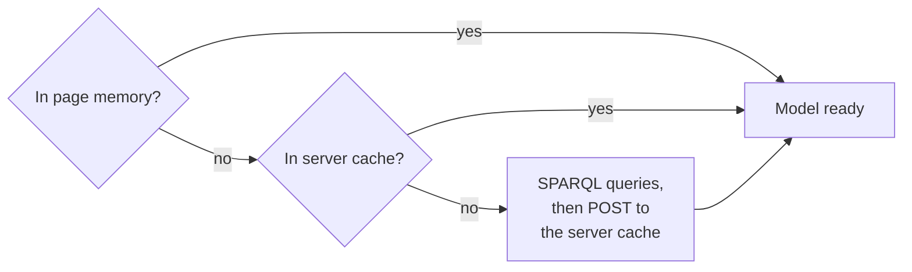

<!-- AUTO-GENERATED: do not edit by hand -->
# Shared

<!-- AUTO-DESC:START -->

This page summarizes the code structure for this directory and its immediate subdirectories. It focuses on the `public / vocables / modules / shared` area within the `public` module. Use the table of contents below to navigate deeper.


## Overview 

The **Shared** directory contains cross-cutting front-end utilities used across SousLeSens tools.

It covers:
- Authentication and session bootstrap
- UI helpers (messages, dialogs, layout, themes)
- Graph and tree helpers
- Export utilities
- Ontology model loading and server-side caching
- SHACL helpers and subgraph generation
- Real-time Socket.IO wiring
- A LESS theme entry file that imports tool skins and defines shared theme variables and utility classes

Most JavaScript modules follow a **dual export pattern** (`export default` + `window.*`) to support both ES module imports and legacy global usage.

---

## Modules (EN)

### Authentication & session
- **authentication** (`authentification.js`) — Initializes the current user context via `/api/v1/auth/whoami`, redirects to `/login` if not logged in, fills `authentication.currentUser` (login + groups), and provides `logout()` via `/api/v1/auth/logout` followed by a backend-provided redirect.
  - **Exports**: `export default authentication; window.authentication = authentication`

### Clipboard / selection helpers
- **Clipboard** (`clipboard.js`) — In-app clipboard storing copied items (single item by default; multi-selection when Alt is pressed) and providing visual feedback (CSS selection and VisJS node blinking).
  - **API**: `copy(...)`, `getContent()`, `clear()`

### Core utilities
- **common** (`common.js`) — General toolbox: select helpers, array helpers (`common.array.*`), string/URI utilities, clipboard copy/paste, color and date helpers, plus Config-driven helpers.
  - **Exports**: `export default common; window.common = common`

### Graph import & VisJS adapters
- **GraphLoader** (`graphLoader.js`) — Dialog-driven import of an ontology/source from a URL via `POST ${Config.apiUrl}/jowl/importSource`, then reloads sources via `MainController.loadSources`.
  - **Exports**: `export default GraphLoader; window.GraphLoader = GraphLoader`
- **GraphController** (`graphController.js`) — Converts binding-like rows into VisJS `{ nodes, edges }` with configurable display options and edge duplicate prevention (also checks inverse edges).
  - **Exports**: `export default GraphController; window.GraphController = GraphController`

### Export utilities (DataTables, CSV, JSON, PlantUML)
- **Export** (`export.js`) — Exports graphs/trees/descendants to DataTables and supports downloads as CSV/JSON/PlantUML, with a popup export menu.
  - **Exports**: `export default Export; window.Export = Export`

### SHACL helpers
- **Shacl** (`shacl.js`) — Prefix management and SHACL Turtle string generation helpers, including OWL cardinality → SHACL count conversion.
  - **Exports**: `export default Shacl; window.Shacl = Shacl`

### Application orchestration
- **MainController** (`mainController.js`) — Central controller: config bootstrap, sources/profiles loading, controller initialization, tool selection/routing, URL params parsing, and basic user logging.
  - **Exports**: `export default MainController; window.MainController = MainController`

### Ontology model loading & server cache
- **OntologyModels** (`ontologyModels.js`) — Loads and maintains per-source ontology “models” (classes/properties/constraints/restrictions), with read/write/update cache endpoints and constraint utilities (allowed properties between nodes, domains/ranges, inferred models, etc.).
  - **Exports**: `export default OntologyModels; window.OntologyModels = OntologyModels`

### Real-time events (Socket.IO)
- **socketIoProxy** (`socketIoProxy.js`) — Initializes Socket.IO client handlers: stores `Config.clientSocketId` on connect and forwards `"KGbuilder"` events to `MappingModeler.socketMessage(message)`.
  - **Behavior**: side-effects on import (no exported API)

### Subgraph generation (restrictions → triples / SHACL / VisJS)
- **SubGraph** (`subGraph.js`) — SPARQL-based recursive restriction extraction from a base class, then:
  - instantiates derived triples
  - generates SHACL Turtle
  - can convert triples to RDF via API
  - can build VisJS data for visualization
  - **Exports**: `export default SubGraph; window.SubGraph = SubGraph`
- **SubGraph (Y variant)** (`subGraphY.js`) — Alternative approach using `OntologyModels.getAllowedPropertiesBetweenNodes` in “restrictions” mode, then generates SHACL Turtle and converts it to triples via `${Config.apiUrl}/rdf-io`.
  - **Exports**: `export default SubGraph; window.SubGraph = SubGraph`

### Tree & treemap utilities
- **TreeController** (`treeController.js`) — Builds jsTree nodes from binding-like rows, enforces a 500-node display limit, and loads/appends via `JstreeWidget`.
  - **Exports**: `export default TreeController; window.TreeController = TreeController`
- **TreeMap** (`treemap.js`) — Contains large hierarchical sample datasets and renders treemap/partition views by loading HTML snippets and relying on D3/Treemap logic provided externally.
  - **Exports**: `export default TreeMap; window.TreeMap = TreeMap`

### UI foundation
- **UI** (`UI.js`) — Shared UI helpers: messages/wait indicator, responsive resizing, menu/panel toggles, tab helpers, dialog helpers (including side-by-side dialog placement), and theme integration via LESS variable updates.
  - **Exports**: `export default UI; window.UI = UI`

### Theme / styling (LESS entry file)
- **Theme entry stylesheet** (`(theme entry LESS file)`) — A LESS “entry” file that:
  - imports tool skins (KGquerySkin.css, lineageSkin.css, KGcreatorSkin.css) and shared widget/icon styles (Sourceselector.css, PopUp.css, NodesInfos.css, icons.css, Bot.css)
  - declares theme variables (fonts, sizes, colors, icon paths, flags like `@isDarkTheme`)
  - defines reusable CSS helper classes (borders, fonts, buttons)
  - applies conditional colors using LESS `if(...)` for `html` and `.vis-network`
  - styles common UI elements (dialogs max size, tool menu layout, icon backgrounds, etc.)

---

## Features (EN)

- User/session bootstrap and logout routing.
- Generic utility toolbox (arrays, strings/URIs, colors, dates, clipboard text).
- Graph import and VisJS adapters.
- Export pipelines (DataTables + CSV/JSON/PlantUML downloads).
- Ontology model loading and caching with SPARQL-derived constraints utilities.
- SHACL helpers and subgraph-to-SHACL/triples/VisJS workflows.
- Real-time socket wiring for tool notifications.
- UI foundation and theme entry styling (LESS variables + shared CSS helpers).

---

## Notes / caveats (EN)

- Some modules rely on runtime globals rather than explicit imports (e.g., `common`, `UI`, `Sparql_proxy`, `KGcreator`, `VisjsGraphClass`, `OntologyModels`, `async`).
- `subGraph.js` and `subGraphY.js` both export `window.SubGraph`, so loading both can overwrite the global depending on load order.
- `TreeMap` relies on snippet-provided functions/variables not defined inside the module file.

---

## Usage (EN)

1. **Bootstrap session + app config**  
   Call `authentication.init(...)`, then load runtime config with `MainController.initConfig(...)` and run `MainController.onAfterLogin(...)`.

2. **Use shared UI primitives**  
   Use `UI.message(...)` for progress/wait and `UI.openDialog(...)` / `UI.setDialogTitle(...)` for consistent dialog handling.

3. **Load ontology models when needed**  
   Before class/property pickers or constraint-based logic, load models with `OntologyModels.registerSourcesModel(...)`.

4. **Graph / tree helpers**  
   Import sources with `GraphLoader`, build VisJS data with `GraphController`, and populate jsTree with `TreeController`.

5. **Export and interchange**  
   Use `Export.exportGraphToDataTable(...)` / `Export.showDataTable(...)` to display or export results.

6. **Optional**  
   Use `Shacl` + `SubGraph`/`SubGraphY` for SHACL/subgraph workflows, and import `socketIoProxy.js` to enable Socket.IO wiring.


<!-- AUTO-DESC:END -->

(ontology-model)=

## Ontology model in depth

The ontology model is a per-source digest of the schema declared in a graph: its classes, object properties, datatype and annotation properties, domains and ranges. The tools read it instead of querying the triplestore for every list or check. It is computed in the browser by `OntologyModels.registerSourcesModel` (`ontologyModels.js`), kept in browser memory, and shared between users through an in-memory cache of the server process (`api/v1/paths/ontologyModels.js`).

### Model structure

`Config.ontologiesVocabularyModels[source]` holds one model per source:

| Field                 | Content                                                                                                                                                                                                    |
| --------------------- | ---------------------------------------------------------------------------------------------------------------------------------------------------------------------------------------------------------- |
| `graphUri`            | Named graph the model is computed from.                                                                                                                                                                    |
| `classes`             | `{ [classUri]: { id, label, superClass, superClassLabel } }`: named `owl:Class` and `rdfs:Class` resources, each with a single parent.                                                                    |
| `classesCount`        | Number of named `owl:Class` resources in the graph, set even when `classes` is left empty.                                                                                                                |
| `properties`          | `{ [propUri]: { id, label, inverseProp, superProp } }`: resources declared `owl:ObjectProperty` or `rdf:Property`.                                                                                       |
| `nonObjectProperties` | `{ [propUri]: { id, label, domain, range } }`: resources declared `owl:DatatypeProperty`, `owl:AnnotationProperty` or `rdf:Property`.                                                                    |
| `propertyTypes`       | `{ [propUri]: { [typeUri]: true } }`: every declared type of each property among the four above. `rdf:Property` puts a property in both `properties` and `nonObjectProperties`, so this map is what tells an object property from a datatype one. |
| `constraints`         | `{ [propUri]: { domain, domainLabel, range, rangeLabel, label, superProp } }`: declared domains and ranges, completed by the inverse and inherited ones. An inherited value adds `domainParentProperty` or `rangeParentProperty`. |
| `restrictions`        | `{ [propUri]: [ { domain, range, blankNodeId, ... } ] }`: OWL restrictions, filled only when restrictions are created or deleted in Lineage, never read from the graph.                                                                      |

### How a model is computed

`registerSourcesModel` first looks for the model in the page, then in the server cache, and only computes it when both miss:



When both miss, or when the model is refreshed, the graph of the source is read in five steps. Its imports are not read: they get models of their own.

1. **Properties.** The object properties are read with their label, their inverse and their parent property. The datatype and annotation properties are read with their domain and range.
2. **Property types.** Each property keeps its declared types, so that the tools can tell an object property from a datatype one.
3. **Classes.** Each class is read with its label and one parent class. Above 20,000 classes, set by `Config.ontologyModelMaxClasses`, only the number of classes is kept, to keep the model light.
4. **Domains and ranges.** The declared domains and ranges are read. A property that declares none takes those of its inverse property, swapped, or those of its parent property. A declared value is never replaced.
5. **Cache.** The model is stored in the server cache, so that the other users do not compute it again.

```{toctree}
:maxdepth: 5
:caption: Contents

```

<!-- AUTO-INLINE-FILES:START -->

## Files in this directory

- `authentification.js`
- `clipboard.js`
- `common.js`
- `export.js`
- `graphController.js`
- `graphLoader.js`
- `mainController.js`
- `ontologyModels.js`
- `shacl.js`
- `socketIoProxy.js`
- `styles.less`
- `subGraph.js`
- `subGraphY.js`
- `treeController.js`
- `treemap.js`
- `UI.js`

<!-- AUTO-INLINE-FILES:END -->

