# ConfigEditor

The ConfigEditor is the central administration interface of SousLeSens. It allows administrators to manage all aspects of the instance configuration, including global settings, users, profiles, data sources, databases, plugins, and system logs.

```{contents} Table of Contents
:depth: 3
```

## Settings

The Settings tab allows you to configure global parameters for the SousLeSens instance.

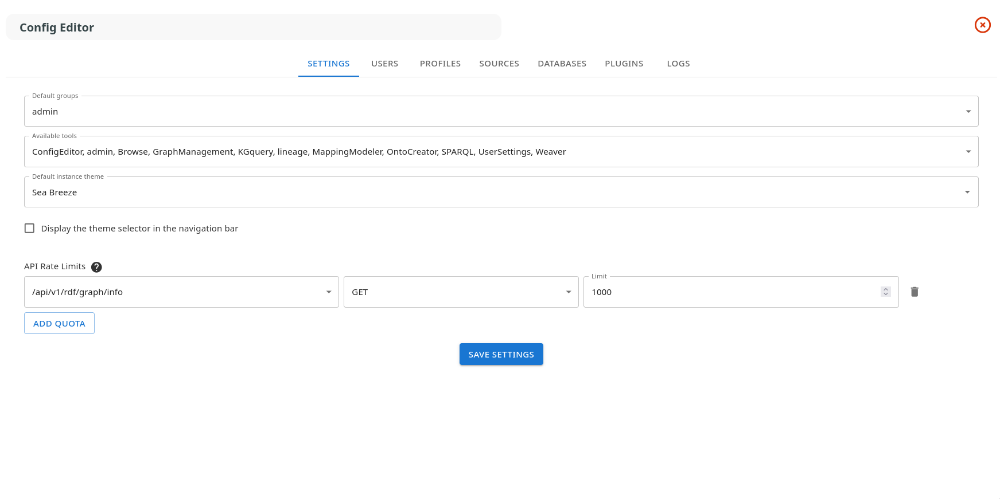

### Default Groups

Select which profiles are assigned by default to new users. Multiple profiles can be selected.

### Available Tools

Choose which tools are accessible to users. The ConfigEditor tool cannot be disabled. Tools are displayed with their type in italics.

### Theme Configuration

- **Default Instance Theme**: Select the default color theme for the instance
- **Display Theme Selector**: Enable or disable the theme selector in the navigation bar, allowing users to choose their preferred theme

### API Rate Limits

Configure rate limiting for API endpoints to prevent abuse:

1. Click "Add quota" to create a new rate limit rule
2. Select an API route from the dropdown
3. Choose the HTTP method (GET, POST, etc.)
4. Set the maximum number of requests allowed per minute
5. Delete individual rules with the trash icon

## Users

The Users tab displays all registered users and allows user management.

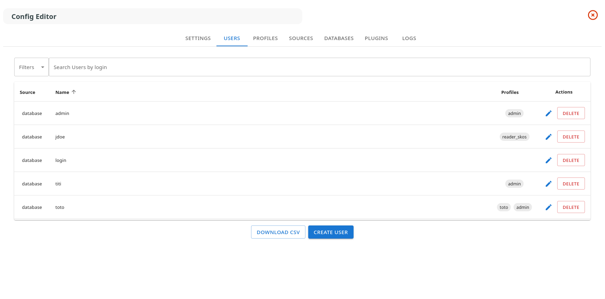

### User List

The table shows:

- **Source**: Authentication source (e.g., "database")
- **Name**: User login
- **Profiles**: Assigned profiles (clickable chips that navigate to the profile)
- **Actions**: Edit or delete buttons

### Creating a User

Click "Create User" to open the user creation dialog:

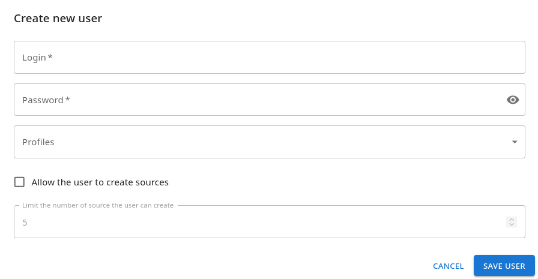

1. **Login**: Unique username (required)
2. **Password**: User password (required for database authentication)
3. **Profiles**: Select one or more profiles to assign
4. **Allow Source Creation**: Check to permit the user to create new data sources
5. **Source Creation Limit**: Set maximum number of sources the user can create (disabled if source creation is not allowed)

### Editing a User

Click the edit icon to modify user properties. The login cannot be changed for existing users.

### Delete User

Remove a user (confirmation required).

## Profiles

The Profiles tab manages user profiles (roles) that define permissions and access control.

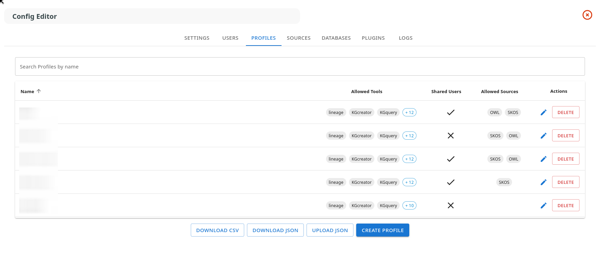

### Profile List

The table displays:

- **Name**: Profile identifier
- **Allowed Tools**: Tools accessible to users with this profile (first 3 shown, others in tooltip)
- **Shared Users**: Indicates if users with this profile are shared across sources
- **Allowed Sources**: Source schemas permitted for this profile
- **Actions**: Edit or delete buttons

### Creating/Editing a Profile

Click "Create Profile" or the edit icon to open the profile editor:

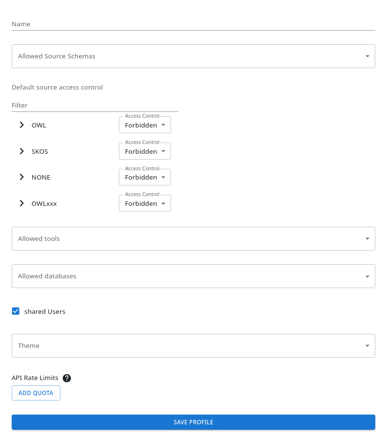

#### Basic Settings

- **Name**: Unique profile identifier (cannot be changed after creation)
- **Allowed Source Schemas**: Select which source types (e.g., SKOS, OWL) this profile can access
- **Default Source Access Control**: Configure read/write permissions for sources using a tree view
    - Filter sources with the search bar
    - Expand the tree to navigate source hierarchy
    - Set access level: Forbidden, Read, or Read & Write

#### Tools and Databases

- **Allowed Tools**: Select which tools are available to this profile
- **Allowed Databases**: Choose which registered databases this profile can access
- **Shared Users**: Enable to share users across all sources

#### Advanced Settings

- **Theme**: Override the default theme for users with this profile
- **API Rate Limits**: Set profile-specific rate limits
    - Add quota rules per route and method
    - **Whole Profile**: When checked, the limit applies to the sum of all routes combined

## Sources

The Sources tab manages data sources (knowledge graphs) available in SousLeSens.

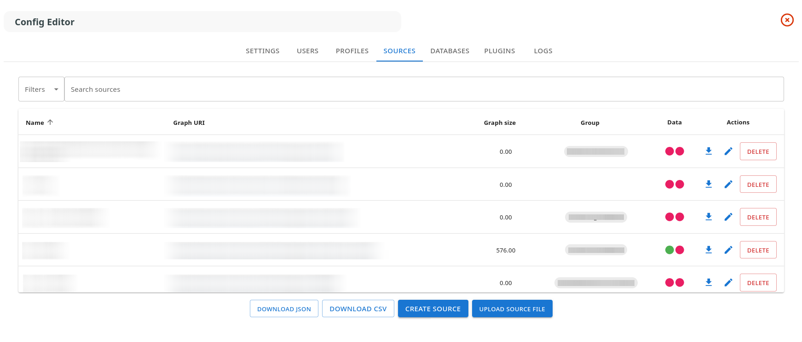

### Source List

The table displays:

- **Name**: Source identifier
- **Graph URI**: Linked URI of the RDF graph (opens in new tab)
- **Graph Size**: Number of triples (human-readable format)
- **Group**: Source group/organization (displayed as chip)
- **Data**: Status indicators
    - **Green circle**: Graph or index available
    - **Red circle**: Graph or index missing
- **Actions**: Download, edit, delete buttons

### Creating a Source

Click "Create Source" to open the source creation dialog:

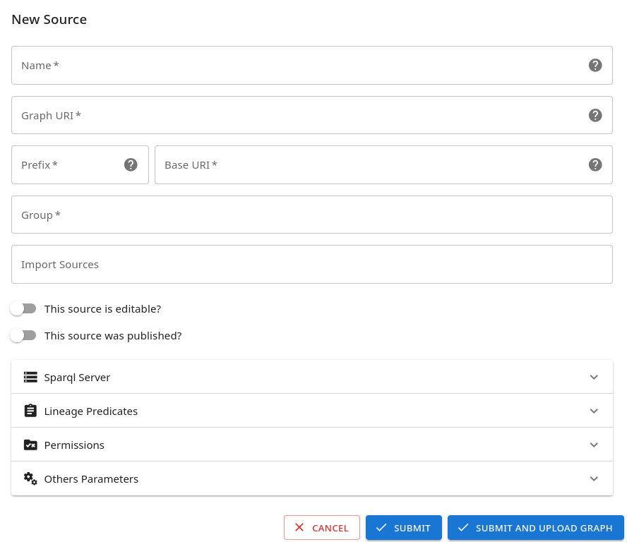

1. **Name**: Unique source identifier
2. **Graph URI**: SPARQL endpoint or RDF graph URI
3. **Group**: Organizational group (e.g., "CFIHOS/Equipment")
4. **Schema Type**: Select ontology type (SKOS, OWL, etc.)
5. **SPARQL Server**: Configure SPARQL endpoint URL and authentication
6. **Imports**: List of other sources to import
7. **Predicates**: Configure taxonomy predicates for hierarchy navigation
8. **Options**:
    - Editable: Allow modifications
    - Is Draft: Mark as work in progress
    - Allow Individuals: Enable instance data

### Delete Source

Remove a source (confirmation required).

## Databases

The Databases tab manages SQL database connections used by SousLeSens.

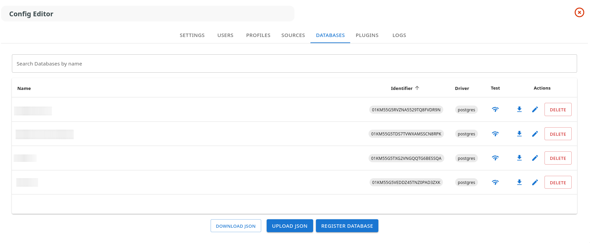

### Database List

The table shows:

- **Name**: Database display name
- **Identifier**: Unique ID (click to copy to clipboard)
- **Driver**: Database type (PostgreSQL, SQLServer)
- **Test**: Connection test button
- **Actions**: Download, edit, delete buttons

### Registering a Database

Click "Register Database" to add a new connection:

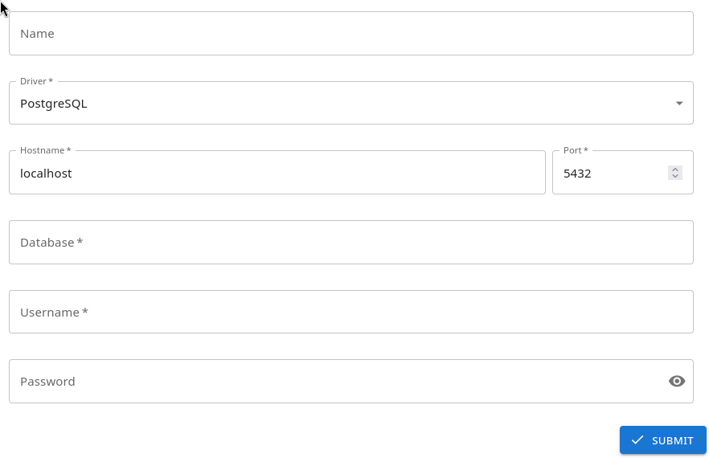

1. **Name**: Friendly name for the database
2. **Driver**: Select PostgreSQL or SQLServer
3. **Hostname**: Database server address
4. **Port**: Connection port (e.g., 5432 for PostgreSQL)
5. **Database**: Database name
6. **Username**: Connection user
7. **Password**: Connection password

## Plugins

The Plugins tab manages plugin repositories and configuration.

### Repositories Tab

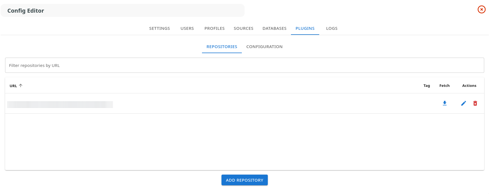

#### Repository List

- **URL**: Git repository URL
- **Tag**: Version tag (if specified)
- **Fetch**: Update repository button
- **Actions**: Edit, delete buttons
- **Plugin Count**: Badge showing number of plugins in repository

#### Managing Repositories

1. **Add Repository**:
    - Enter Git URL
    - Select version tag (optional)
    - Choose which plugins to activate (for multi-plugin repositories)
    - Provide authentication token if required

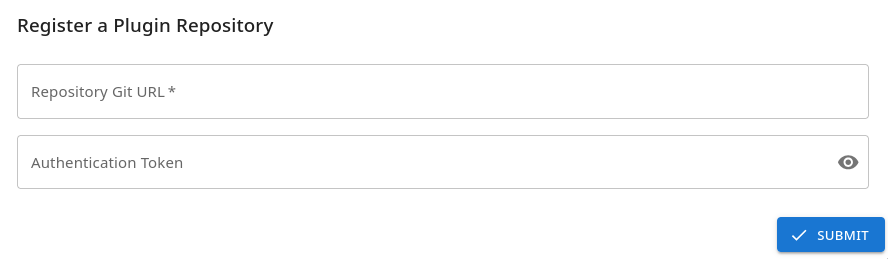

2. **Fetch Repository**: Update plugin list from remote repository

3. **Delete Repository**: Remove repository (confirmation required)

### Configuration Tab

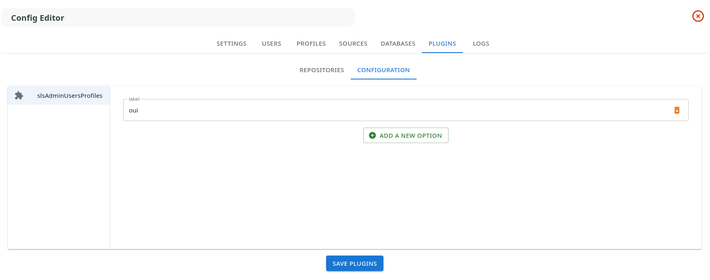

Configure enabled plugins:

1. Select a plugin from the left panel
2. Add or modify configuration options:
    - Click "Add a new option"
    - Enter label (key) and value
    - Delete options with the trash icon
3. Click "Save Plugins" to apply changes

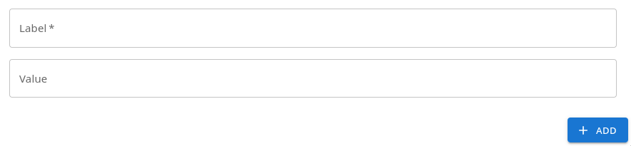

## Logs

The Logs tab provides access to system activity logs.

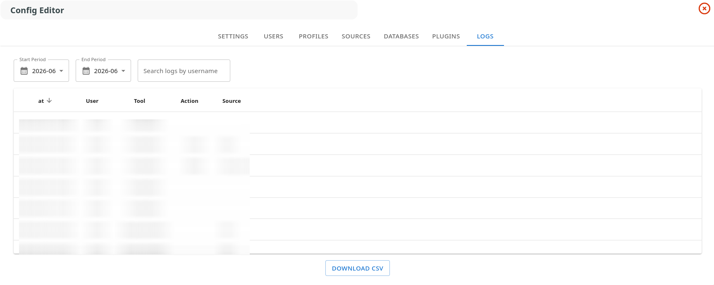

The table displays:

- **Timestamp**: Date and time of the action
- **User**: Username who performed the action
- **Tool**: Tool used (e.g., ConfigEditor, Lineage)
- **Action**: Action type (create, edit, delete, save)
- **Source**: Affected source or resource
