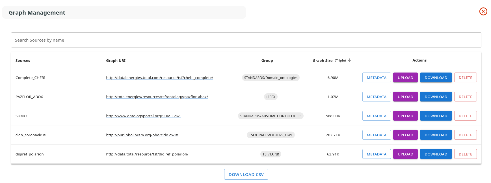
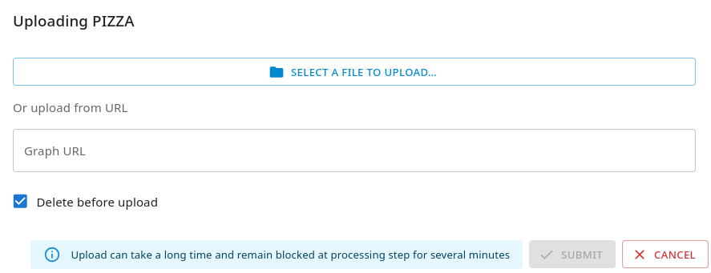
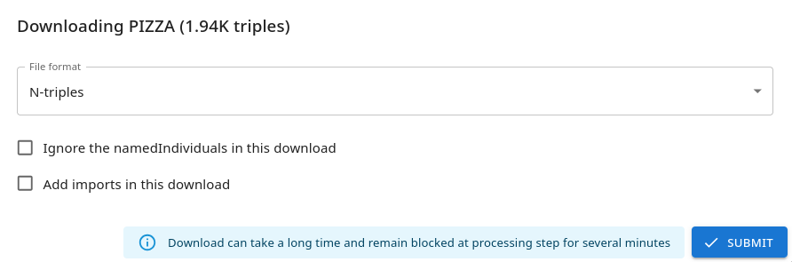

# GraphManagement

GraphManagement is the tool for managing RDF graphs in SousLeSens. It allows you to upload, view, and manage graph data for your configured sources.

```{contents} Table of Contents
:depth: 3
```

## Overview

GraphManagement provides a centralized interface to:

- Upload RDF graphs to configured sources
- View graph statistics (number of triples, etc.)
- Manage graph lifecycle

## Uploading a Graph

### Upload Steps

1. Navigate to the **GraphManagement** tool from the main navigation bar

2. Select your source from the list of available sources



3. Click **"Upload Graph"** or drag and drop your RDF file

<!-- -->



4. Select your RDF file:

    - Supported formats: **RDF/XML**, **Turtle**, **N-Triples**, **JSON-LD**
    - Click **"Open"** or drop the file in the upload area

5. Wait for the upload to complete:

    - Progress is displayed during upload
    - Large graphs may take several minutes to process

6. Verify the upload:
    - **Graph Size** displays the number of triples
    - **Status** shows "Available" or similar indicator

## Supported RDF Formats

GraphManagement supports the following RDF serialization formats:

| Format    | Extension         | MIME Type               |
| --------- | ----------------- | ----------------------- |
| RDF/XML   | `.rdf`, `.xml`    | `application/rdf+xml`   |
| Turtle    | `.ttl`, `.turtle` | `text/turtle`           |
| N-Triples | `.nt`             | `application/n-triples` |
| JSON-LD   | `.jsonld`         | `application/ld+json`   |

## Managing Existing Graphs

### Replace a Graph

To replace an existing graph:

1. Select the source in GraphManagement
2. Click **"Upload Graph"**
3. Upload the new RDF file
4. Confirm replacement when prompted

> **Warning**: Replacing a graph will delete all existing triples for that source.

### Delete a Graph

To delete a graph:

1. Select the source in GraphManagement
2. Click **"Delete Graph"**
3. Confirm deletion

> **Warning**: This action cannot be undone. All graph data will be permanently deleted.

### Download a Graph

To download/export a graph:

1. Select the source in GraphManagement
2. Click **"Download Graph"**

<!-- -->



3. Choose the export format (RDF/XML, Turtle, etc.)
4. Click **"Download"** to save the file
