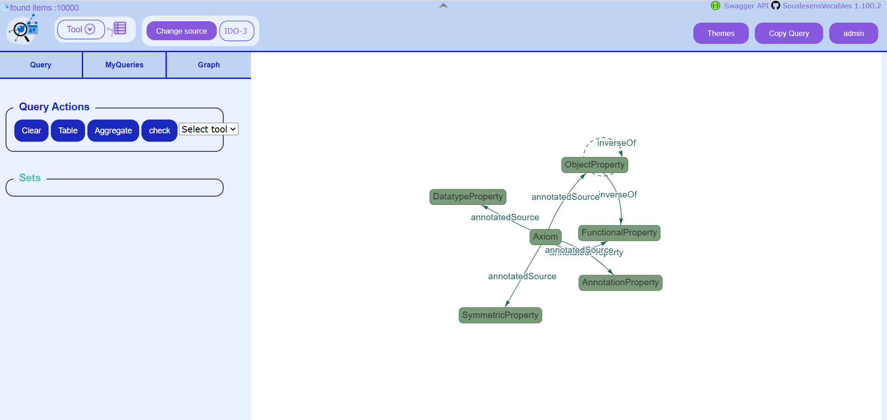
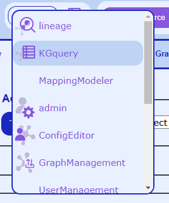
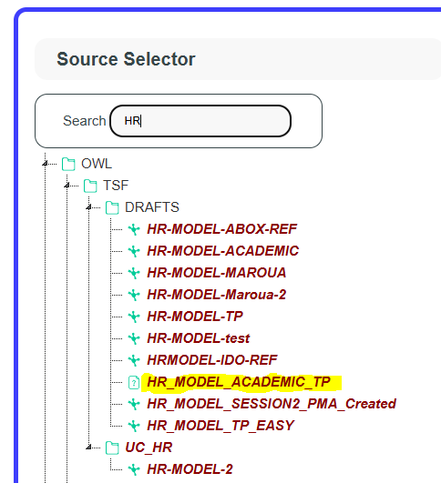
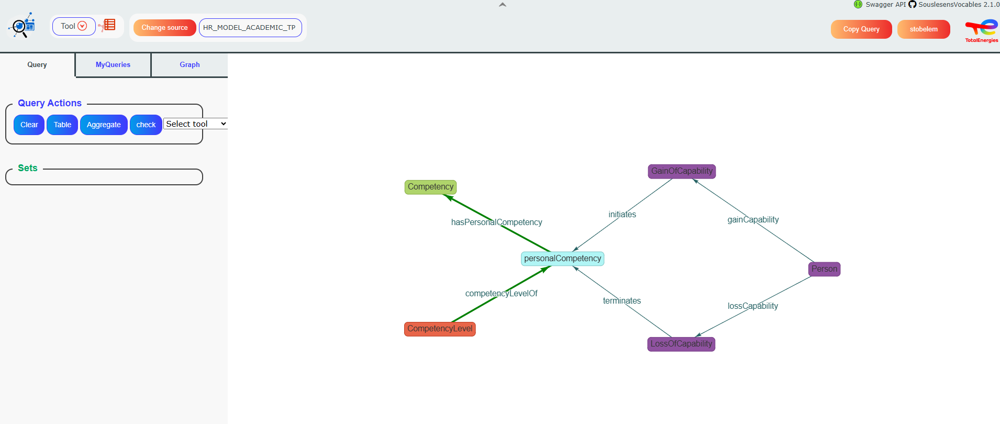
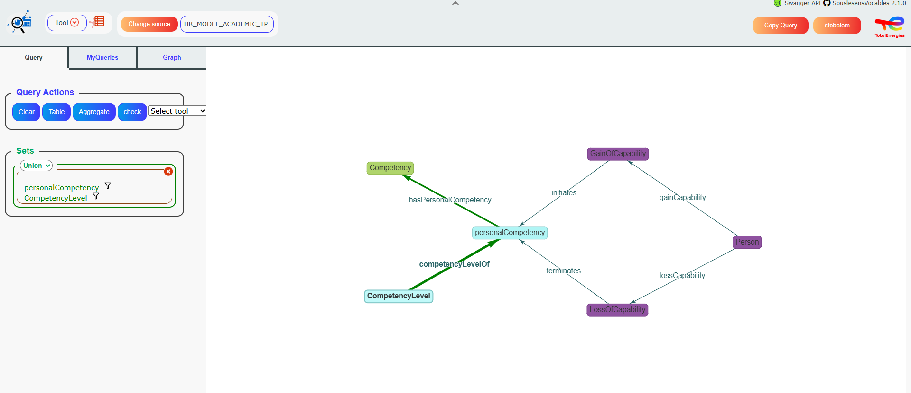
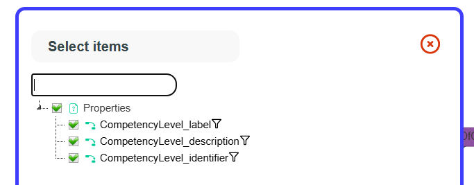
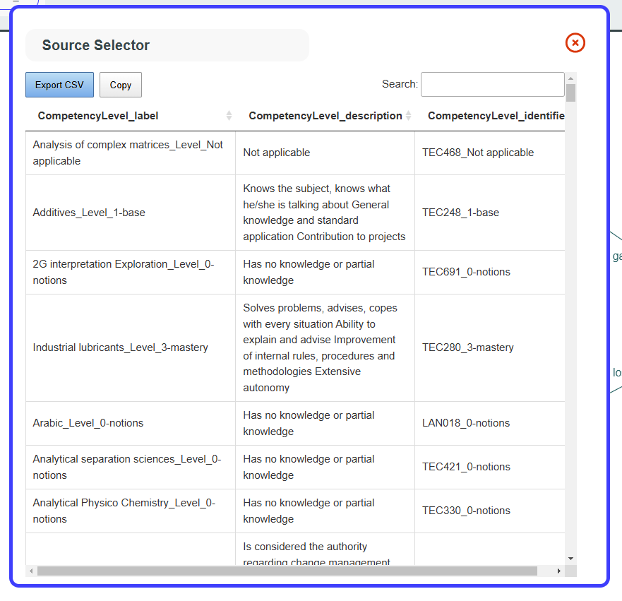
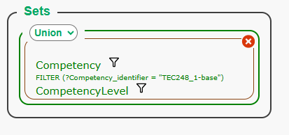
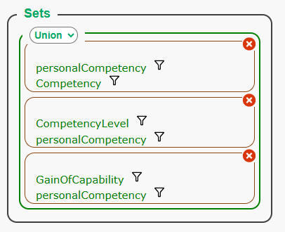

# KGQuery

**This document contains both:**

1.  **Information about KGquery tool operation**

2.  **A tutorial on how to use the tool**


```{contents} Table of Contents
:depth: 3
```

## Overview

KGQuery is a tool from SousLeSens framework, an ontology and semantic
knowledge management toolbox.

KGQuery is designed to query semantic data (triples) using a semantic
model (a graph). It allows users to create requests from the graph,
apply filters, calculate aggregates, display results in table or graph
form, and save or retrieve queries.

## Features

### 1. Semantic Graph Exploration

-   Display the semantic model as a graph.

-   Customize graph style.

### 2. Query Building & Execution

-   Graph-based query creation by selecting classes.

-   Automatically find linked objects between selected classes.

-   Support complex queries by detecting intermediate relations.

-   Execute queries and generate SPARQL requests.

### 3. Query Result Visualization

-   Display results in a table format with sorting and searching.

-   Allow exporting data in CSV format.

-   Clicking on a property reveals additional node information.

### 4. Advanced Filtering Wizard

-   Filter wizard adapts to data type properties.

-   Support for multiple filter conditions.

### 5. Query Operations

-   Union mode: Returns results from all subqueries.

-   Minus mode: Excludes specific results from the query.

### 6. Hypergraph Support

-   Handle aggregated graphs (e.g., multiple datasets combined).

-   Generate hypergraphs

-   Enable manual linking of nodes between different graphs.

## UI overview



*KGQuery main interface*

The KGQuery interface is made of:

-   a central whiteboard where Semantic Knowledge Graphs are drawn.
    Here, the user can select objects by clicking on them and move items
    around by dragging and dropping.

-   a left panel with three tabs:

    -   Query: with options to query the current graph

    -   MyQueries: to save queries and retrieved saved queries

    -   Graph: to load, reload, edit, or save a graph

## Tutorial

### Showing a Semantic Knowledge Graph

Open SLS and choose the KGQuery tool in the top left menu.

A window opens, asking you to select a data source. Search for “HR” and
select “HR\_MODEL\_ACADEMIC\_TP”. This source contains HR data and is
perfect for this demo.




*Left: menu to select the KGQuery tool. Right: window to select a
source.*

A graph should show up in the whiteboard. If nothing shows up, go to the
“Graph” tab in the left panel, and click on the “loadSaved” button.



*The “OneData” Dalia’s semantic knowledge graph for the selected source
shows up.*

In this “Graph” tab in the left panel, the “Sets” section enables you to
customize the graph style. You can change the shape or color of a node
and change the global font size.

### Simple query

Let’s create a simple query with the *personalCompetency* and
*CompetencyLevel* classes.

In the Semantic Web framework, a **class** is a concept or category used
to define a group of entities (individuals) that share common
characteristics.

-   Objects are instantiated from classes. For example, a class “Job”
    represents what a job is, and objects instantiated from the “Job”
    class represent a list of jobs.

-   Classes are linked by relations. For example, a class “Worker” and a
    class “Job” can be linked by the relation “Participates in”.

Let’s click these 2 classes on the graph.



*Step 1 :Two classes are now selected*

The selected classes appear in the left panel, in the Query tab, and
show up in light blue in the graph.

By doing this, we choose to show an **intersection** between these 2
classes. We are asking KGQuery to return <u>all *personalCompetency* and
*CompetencyLevel* objects that are linked with an object of the other
class.</u> For example, a *personalCompetency* that is not linked to a
*CompetencyLevel* won’t be returned.

Now let’s click on the “Table” button, in the “Query” tab of the left
panel.

A window pops up, asking us which fields (data type properties) we want
to show in the results of the query.



*Step 2 : Select data type properties pop-up*

Choose the properties you want to display, then click OK. Here we notice
that the class *personalCompetency* has no property to be displayed.

Behind the scenes, KGQuery compiles a SPARQL query, executes it, and
shows the results in a table.



*Step 3 : visualize data*

On this window, you can see all the corresponding *personalCompetency*
and *CompetencyLevel* objects that are linked by the relationship
“competencyLevelOf”. And you can also:

-   Sort by columns

-   **Copy or save data in CSV format**

-   Click on a property to see information on the corresponding node

-   Search for values in all properties with the search bar in the top
    right corner

### Filter query

Now we will see how to add a filter on a query.

The easiest way is, on the *select data type property* *pop\_up* (at
step 2 in the previous section), to click the funnel icon on a property
on which we want to filter.

This will open the filter wizard. This wizard helps you choose and set
the filter you need.


The filter wizard is dynamic. It changes according to the type of
property selected.

Once a filter has been set, it will become visible in the left panel
under the “Query” tab:



### Complex query

When 2 classes that are not connected are selected, **a graph traversal
algorithm** finds automatically which intermediate classes to query, to
get objects from the 2 selected classes that are linked.

If you select more than 2 objects, relations will add up in the left
panel under the “Query” tab:



Here, you can decide if you want :

-   A union of the results of each subquery, by selecting “Union” in the
    drop-down list. This means that every set of nodes that has at least
    one relationship among those specified will appear in the result.

-   A substraction of the results of each subquery, by selecting “Minus”
    in the drop-down list. Here, results will be those of the first
    query, minus those from other queries.

Example: with the query defined in the last screenshot:

-   If Union is selected, then the results will include all
    *personalCompetency* objects that have at least one relationship
    with either a *Competency*, *CompetencyLevel* or
    *personalCompetency* object.

-   If Minus is selected, then the results will include
    *personalCompetency* objects that have a relationship with a
    *Competency* object, but that do not have a relationship with a
    *CompetencyLevel* or *GainOfCapability* object.

### Hypergraphs

KGquery supports hypergraphs. A hypergraph is a set of graphs joined
together in a single graph. It is an aggregate of several independent
graphs.

The Graph tab includes commands to generate hypergraphs:

-   Use buttons “generateCommonGraph” and then
    “generateCommonDecoration” to regenerate a hypergraph.

-   The “setEdgeMode” button is useful for creating links between
    graphs. When several graphs are displayed but not yet linked, click
    this button, then drag and drop one class to another on the graph to
    create a relationship between these 2 classes.
