# Lineage


The Lineage tool is one of the core components of SousLeSens, a web
application for managing ontologies and knowledge graphs, built on the
Semantic Web framework.

It is designed to visualize ontologies and knowledge graph data as
dynamic, interactive graphs on a whiteboard interface. The underlying
assumption is that users can better understand graphs when they are both
visualized and interactively manipulated.

## Contents

```{contents} Table of Contents
:depth: 3
```


## UI Overview

### Global Overview 

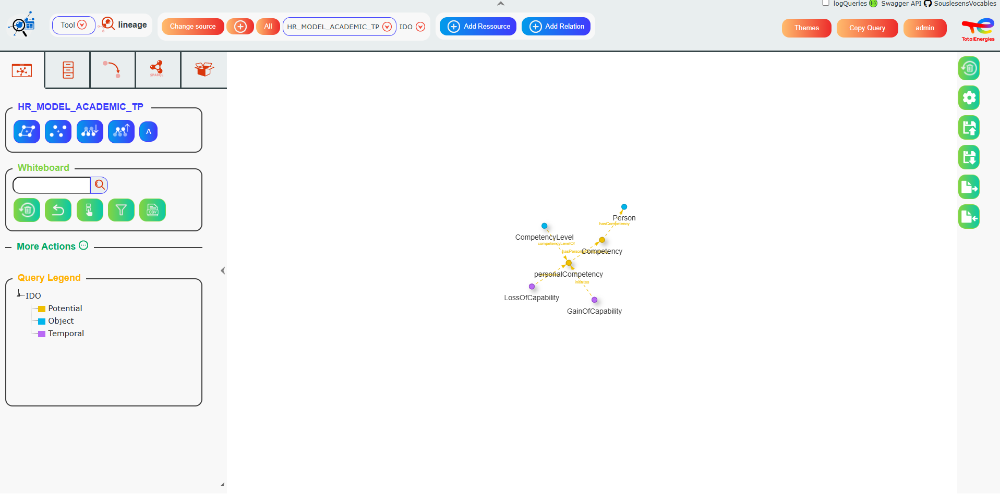

The Lineage UI is composed of three main elements:

-   **A left panel with 5 tabs**: Whiteboard, Classes, Properties,SPARQL
    and Containers
-   **A left panel with 5 tabs**: Whiteboard, Classes, Properties,SPARQL
    and Containers

-   **A whiteboard** to show and manipulate graphs.
-   **A whiteboard** to show and manipulate graphs.

- **A right Pannel with** buttons related to the whiteboard, providing basic
  actions common to multiple tools

The top panel is shared across all tools, but its content varies
depending on the currently selected tool.  
Lineage has the most buttons on the top panel, and it includes all
buttons available in other tools. Therefore, the documentation of the
top panel is comprehensive in this section.

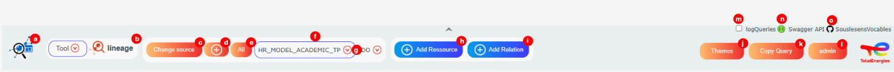

a.  **SousLeSens logo** : Redirects to the home page

b.  **Current tool** : Switch to another tool

c.  **Change source** : Switch to a different graph

d.  **Add source** : Add an additional graph to explore without
    replacing the current one

e.  **All** : Select all panel sources as current sources

f.  **Current sources pannel :**

This panel displays all loaded sources. By default, the selected
source is loaded along with its imports. In some tools, imports are
not shown in the panel.  
The currently selected sources are highlighted in blue. Click on
another source to change it.  
All actions and buttons of the tool will be applied to the current
source.  
You can add sources to this panel using (d) and select all sources
using (e).  
Using (c) to change the source will clear the panel and reload it with
the selected source and its imports.

g.  **Source popup :** Clicking this button opens a popup with several
    options for the source, such as adjusting node opacity, removing it
    from the panel, grouping nodes belonging to the source, copying the
    graph URI, or downloading it in a triple format (e.g., Turtle,
    RDF).  
    If you are the source owner (creator), you can also edit source
    parameters such as child and parent properties, or the main class
    query.

> 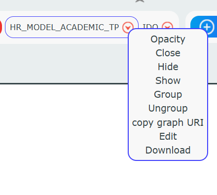

h.  **Add resource :** (Lineage only) Adds a new resource. Covered in a
    dedicated tutorial section

i.  **Add Relation** : (Lineage only) Adds a new resource. Covered in a
    dedicated tutorial section

j.  **Change Theme** : Changes the color theme of SousLeSens.
    Administrators can lock a specific theme, in which case this button
    will not appear

k.  **Copy Query** : Copies the most recent SPARQL query to the
    clipboard

l.  **Account button :** Displays the logged-in user and allows logout

m.  **Logqueries checkbox :** When checked, all performed queries are
    logged in the browser console

n.  **Swagger link :** Opens the SousLeSens Swagger UI to view and
    access all available user API routes

o.  **GitHub link :** Opens the SousLeSens GitHub repository for
    contributing and read the documentation

### Left panel: Whiteboard Tab 

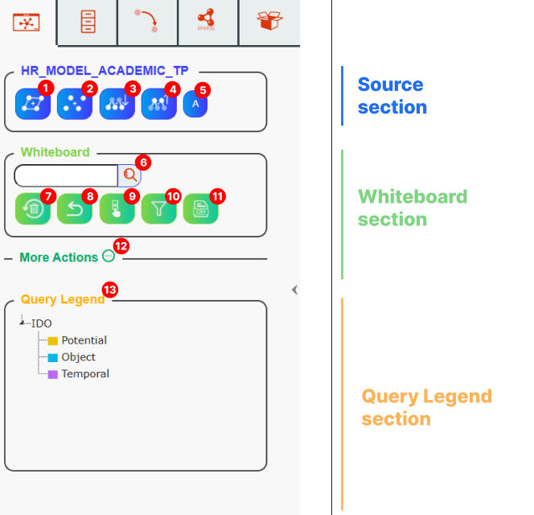

Source section:

1.  **Draw restrictions button** – Draws the main classes and their
    associated restrictions on the whiteboard *if* the whiteboard is
    empty.  
    If the whiteboard already contains nodes, it will draw the
    restrictions related to the currently selected node.  
    Right-clicking on the button opens a popup menu that lets you draw
    restrictions with specific options.  
    This performs the same action, but limited to either **direct**,
    **inverse**, or **all** restrictions.

> 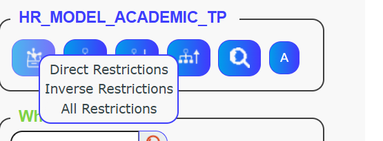

2.  **Main classes button :** Displays the main classes on the
    whiteboard. The main classes are those that meet the top classes
    filter condition (by default, all owl:Class).

This parameter can be edited for each source if you are the source
creator.

> 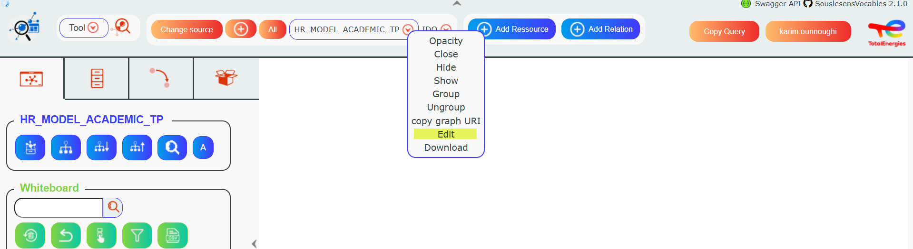

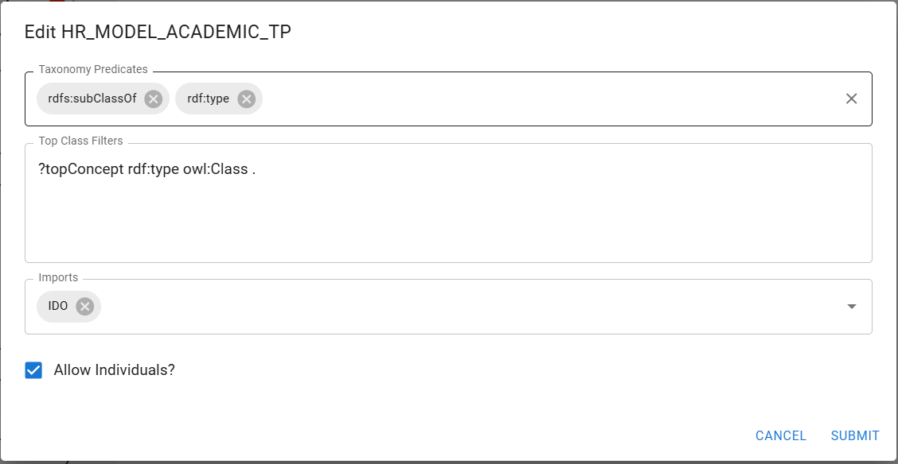

3.  **Children button** – Adds all children of the classes currently
    displayed on the whiteboard.

Children are the elements linked to the current node via taxonomy
predicate properties.


 For example, if a node is displayed, clicking on "Children" will show
 on the whiteboard all nodes that are linked to it via rdf:type or
 rdfs:subclass properties.

4.  **Parents button** – Adds all parents of the nodes currently
    displayed on the whiteboard.

 A parent is defined by taxonomy predicates as well, but the
 relationship is reversed.

5.  **Axioms button**

Displays on the whiteboard all nodes related to an axiom, grouped by
axiom category (e.g., **SubClassOf**, **EquivalentClasses**, or
**DisjointClasses**).

**Whiteboard section**

6.  **Whiteboard search bar :** Searches for a node that is present on
    the whiteboard.

7.  **Clear all button** – Clears the whiteboard

8.  **Clear last button** – Clears all nodes on the whiteboard, except
    for those added by the most recent action.

9.  **Only last button** – Clears all nodes on the whiteboard, except
    for those added by the most recent action.

10.  **Selection button :** Displays a menu with a tree of all classes on
    the whiteboard. This menu primarily handles node decoration and icon
    management.

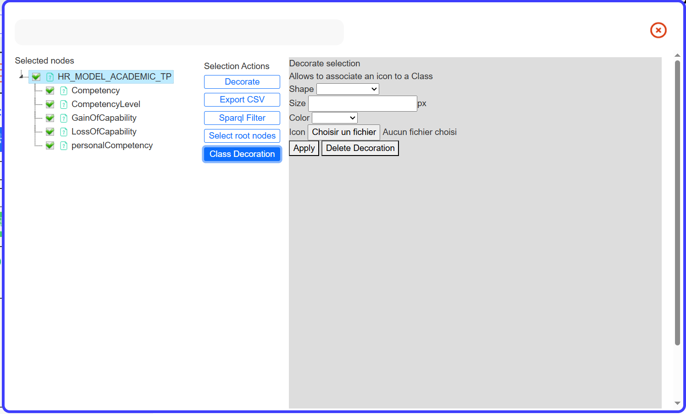

11.  **CSV export button :** Displays the whiteboard in a table format,
    which can be exported to a CSV file.

12.  **More actions button**. Displays an additional set of buttons for
    using advanced features (see below).

 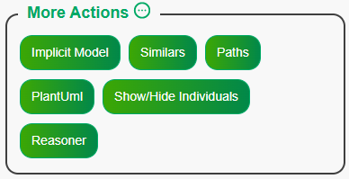

 *Extra features are revealed when the "More Actions" button is
 clicked*

 • **Implicit Model**: Draws the current source's implicit model on the
 whiteboard, which represents the knowledge graph facts.  
 • **Similars**: Displays a menu to show nodes on the whiteboard that
 have similar labels to the currently displayed nodes.  
 • **Paths**: Retrieves the shortest path between two nodes in the
 source.  
 • **PlantUML**: Displays the whiteboard in a PlantUML view.  
 • **Show/Hide Individuals**: Toggles the visibility of individuals on
 the whiteboard.  
 • **Reasoner**: Uses a reasoner on the current source to perform
 inference, consistency, or unsatisfiable operations, and displays the
 results on the whiteboard.

13.  **Query legend**: Explains the color codes used on the graph. Colors
    are selected based on the top-level ontology.

### Left panel: Classes Tab

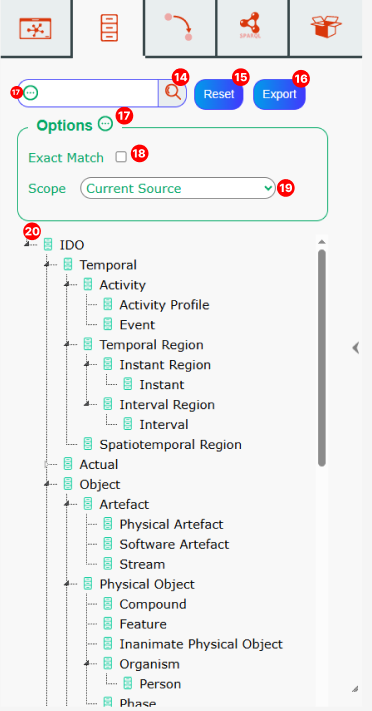

14.  **Classes Search Bar** – Search for classes within the current
    source.

15.  **Reset Search Results Panel** – Resets the search results panel.

16.  **Export Search Results Button** – Exports the search results.

17.  **Hide Options Panel Button** – Hides the options panel.

18.  **Options Panel: Exact Match Option** – If the exact match option is
    checked, the results must be strictly equal; otherwise, a node
    containing the search term is sufficient.

19.  **Options Panel: Scope Option** – By default, the search is
    performed on the current source. You can also search within the
    imported sources or all available sources.

20.  **Search Results Panel** – Results are displayed in a tree format.

### Left panel: Properties Tab

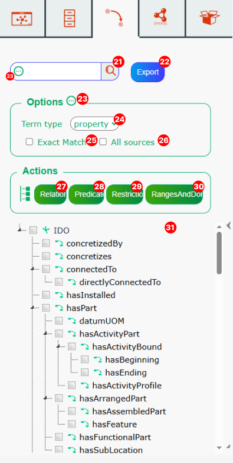

21.  **Properties search bar** – search for properties

22.  **Export search results button**

23.  **Hide options panel button**

24.  **Options panel: Term type option -** Allows you to filter by term
    type.

25.  **Options panel: Exact match option -** If enabled, only exact
    matches will be shown.

26.  **Options panel: All sources option -** Search across all available
    sources.

27.  **Actions panel: Relations button -** Displays predicates and
    restrictions.

28.  **Actions panel: Predicates button**

29.  **Actions panel: Restriction button**

30. **Actions panel: Ranges and Domains -** Displays all ranges and
    domains for a source. See Ranges and Domains tutorial section

31. **Search results panel**

### Left panel : SPARQL

See SPARQL tutorial section

### Left panel : Containers Tab

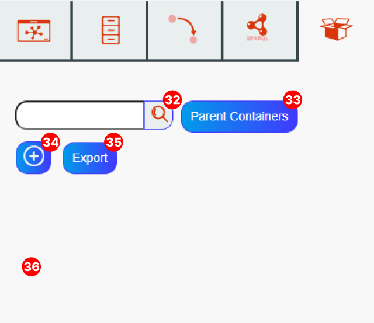

32.  **Container search bar –** Search for rdfs:Container

33.  **Parent containers button :** Displays all parent containers on the
    whiteboard

34.  **Create container button**

35.  **Export containers button**

36.  **Search results panel**

### Right Panel : whiteboard buttons

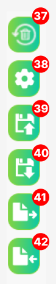

37.  **Clear all button :** Clears the whiteboard

38.  **Display :** Opens a menu to modify the graph display parameters,
    such as spatialization algorithms, node distance, etc.

39.  **Save whiteboard** : Saves the current whiteboard for later reuse.

40.  **Load saved graph** : Load a previously saved whiteboard.

41.  **Export whiteboard** : Exports the current whiteboard in various
    formats (GraphML, SVG, CSV, PlantUML, JSON).

42.  Import whiteboard : Imports and displays a whiteboard from a JSON
    file provided by the SousLeSens JSON export (supports JSON following
    vis.js network format:
    <https://visjs.github.io/vis-network/docs/network/>).

### Shortcuts

Right-clicking on a node triggers a menu with several options.
"NodeInfos" and "Axioms" are detailed in the tutorial below.  
**Expand and Parents** – These options are equivalent to the
children/parent buttons but apply only to the current node.  
**Collapse** – Removes all child nodes of the current node from the
whiteboard.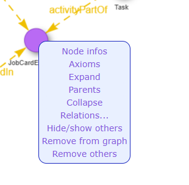

Right-clicking on a search result triggers a popup menu with different
options, depending on the current tab and the node that is clicked.

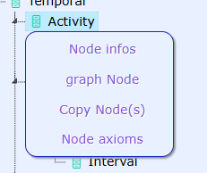

**Ctrl + Alt + Click on a Whiteboard Node**  
Draws all relations of the clicked node.

**Ctrl + Shift + Click on Search Results Panel**  
Allows you to select multiple nodes by clicking on them. The right-click
action will be applied to all selected nodes.

## Tutorial

Let's open the Lineage tool in SousLeSens, and select the source
**HR\_MODEL\_ACADEMIC\_TP** source.


Now, the Lineage tool opens. Click the **Model** button to show the
model on the graph.

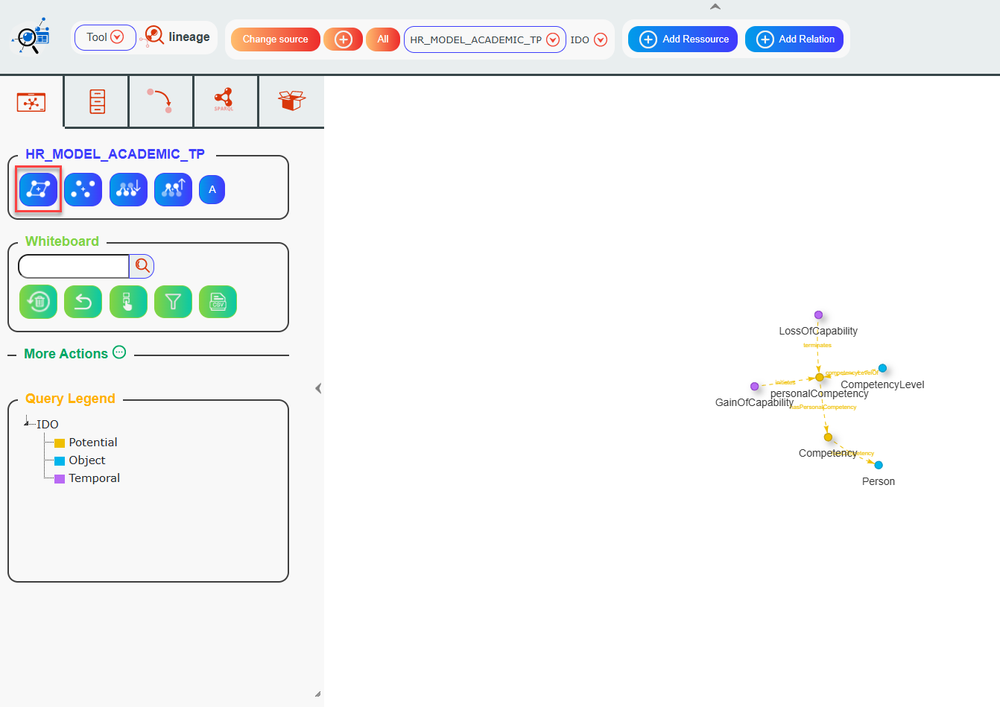

The graph displays the source model graph.

Now if you click the **Expand** button:

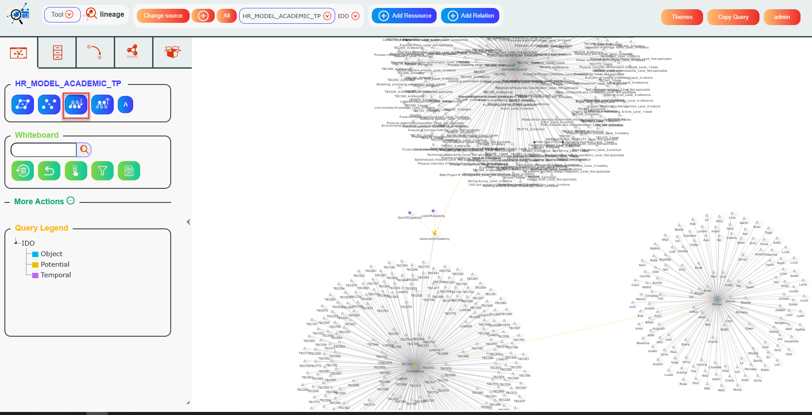

Not only will the model (i.e., the classes) be displayed, but also all
the children of the classes on the whiteboard will appear.

If you click the **Parents** button instead:

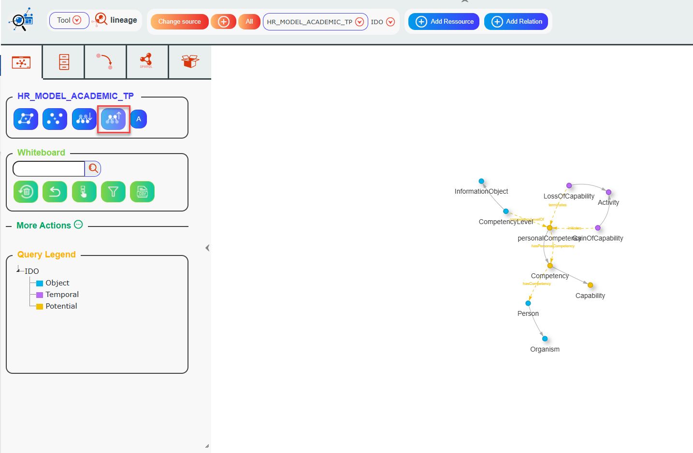

The parent classes of the classes currently displayed will be added to
the graph.

The **Whiteboard** menu allows you to clear the graph, undo an action,
display only the most recently added nodes, or export the current graph
in CSV format. It also contains a search bar: when searching for a
string, all nodes containing the searched string will be highlighted on
the whiteboard.

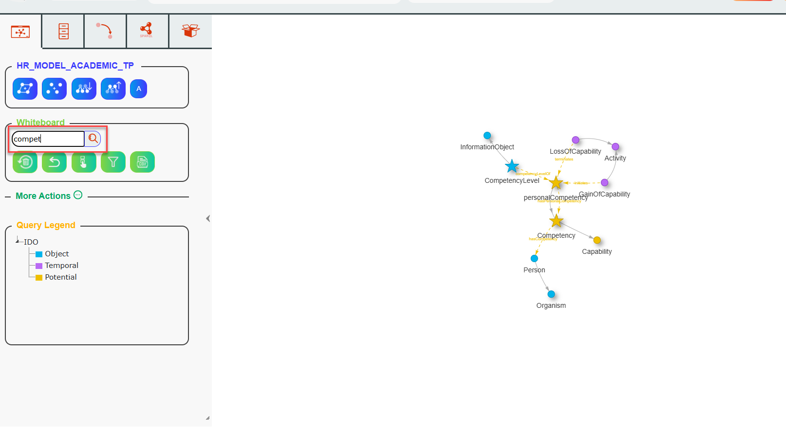

*The whiteboard menu – nodes that match the searched string take a star
shape*

If the displayed graph is large, you can use advanced node search with
the search bar in the **Whiteboard** section.  
Additionally, by right-clicking on a node, you have several options. The
first option is **Node Infos**, which opens a window displaying detailed
node information.

### Creating a relation

By clicking on the **Add Relation** button in the top toolbar, you can
add a relation between two classes.  
A relation is a semantic link between two classes. For example, if there
are two classes, **"Worker"** and **"Project"**, you can define the
relation **"works on"** between **"Worker"** and **"Project"**.  
In this case, **"Worker"** is the subject or range of the relation, and
**"Project"** is the object or domain of the relation. A relation always
goes from subject to object (from range to domain).  
To create a relation, simply drag and drop one class onto another.

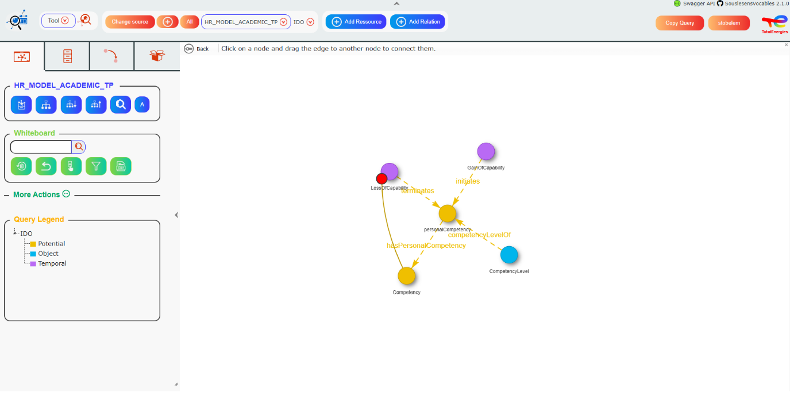

A window will then open, displaying all relation types that correspond
to the selected subject and object types. Choose a relation type, select
the cardinality, and your new relation will be displayed on the graph.


### Class search

Using the search bar in the **Classes** tab in the left panel, you can
search for all classes in the source model, not just the classes
displayed on the whiteboard.

### CSV visualisation

You can export data in CSV format.  
First, the graph displayed on the whiteboard will be rendered as a CSV
file. Each line in the CSV will represent a triple from the graph. To do
this, click the **CSV** button (12). A window will then open:

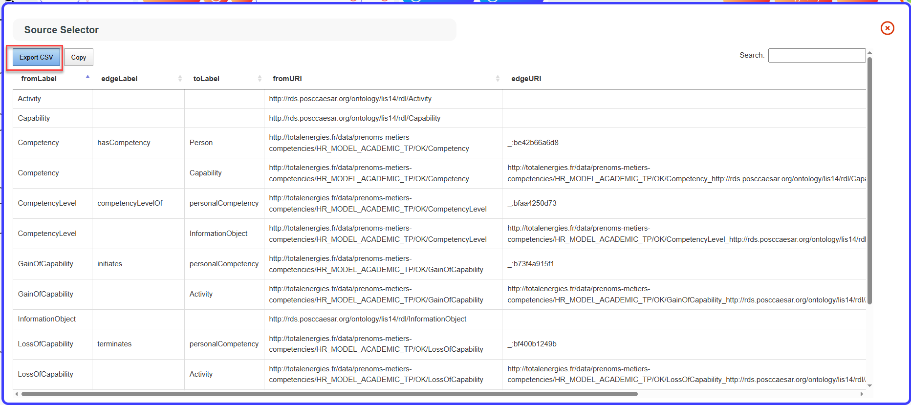

Then click the "Export CSV" button. All data displayed will be saved in
CSV format.

You can also <u>export lists of classes and properties</u>, in the
Classes or Properties tab of the left panel, and before or after a
search. It works the same way: use the Export button in the
corresponding tab.

### Save and load a whiteboard

First, click on the **Save** button (button number on the whiteboard).
Then, set a title for your current whiteboard and select a group, which
will correspond to a folder path that can contain other whiteboards. A
group can contain multiple folders, for example,
project\_whiteboard/project1, to further organize your whiteboards.
These groups are designed to organize your saved whiteboards and make
them shareable with other users. After filling in the label and group,
the current whiteboard can be saved.

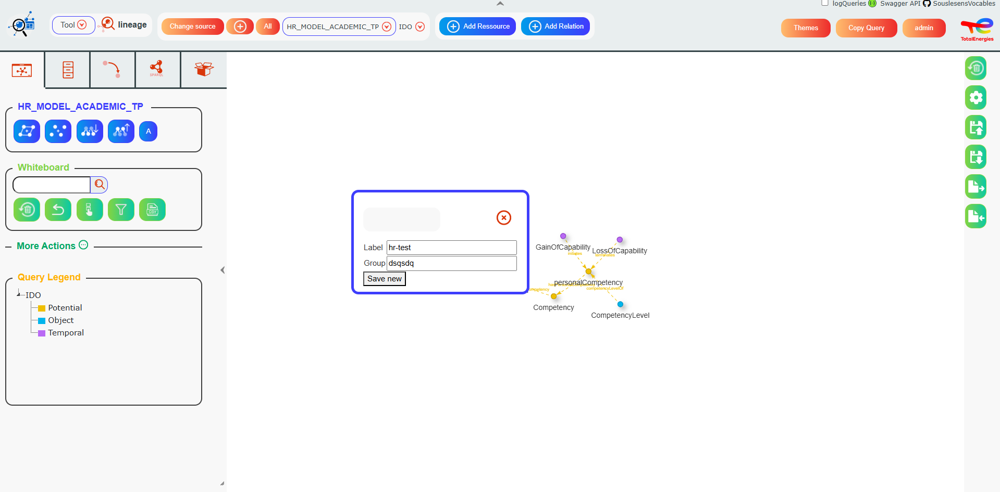

A saved whiteboard can be reloaded by clicking the **Load** button (on
the whiteboard). To do so, simply click on the saved whiteboard you wish
to reload.

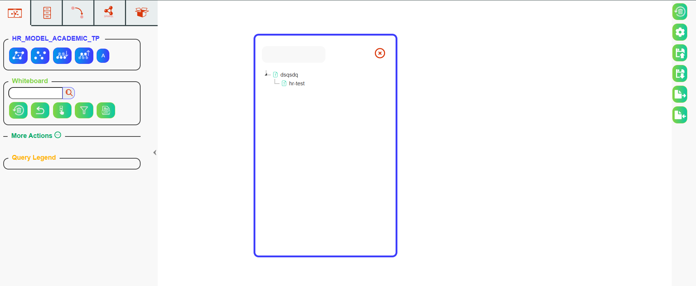

You can also right click on a saved whiteboard to delete or share it.

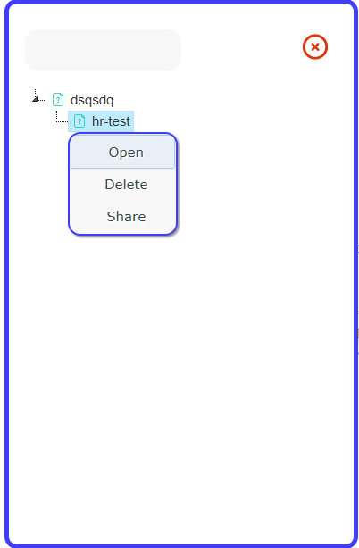

### Create a node

By clicking the **Add Resource** button on the top toolbar, you can add
a node to the graph. This resource will adhere to W3C standards. The
resource can be a class, an individual, or a datatype property
(definitions: <https://www.w3.org/TR/owl-ref/>). A guide will walk you
through the process depending on the type of resource you want to
create. A superclass is required to create a new class, an individual
must be derived from a class, and a datatype property needs a range and
a datatype (e.g., date, string, int…).

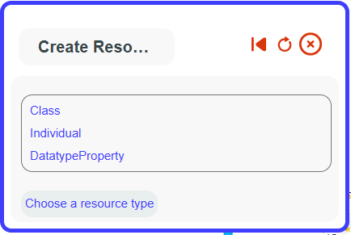

### Ranges and Domains

By clicking on the **Ranges and Domains** button (30), you can visualize
all domains and ranges of the ontology properties graphically. Note that
ranges and domains are not defined for every ontology. See below for the
ranges and domains of IDO.

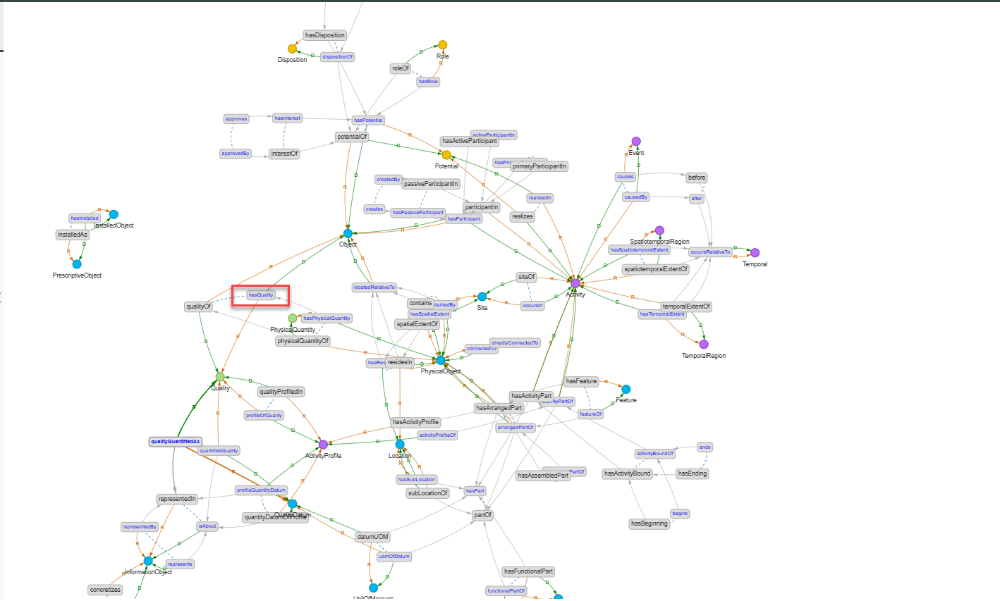

For the **'hasQuality'** property, this means that every time
**'hasQuality'** is used, the domain (starting point) of this property
should be an **Object** or a subclass of **Object**, and the range
(target) should be a **Quality** or a subclass of **Quality**.

### Node Infos 

When you right-click on a node in the graph or the tree, a popup will
appear with the option **NodeInfos**.

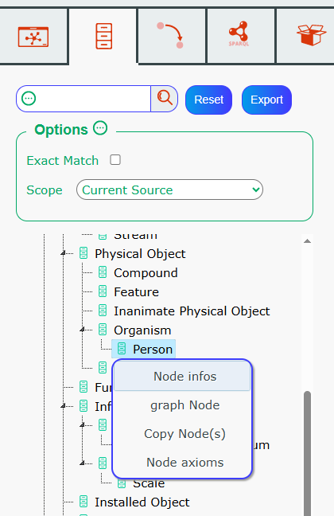

NodeInfos can be displayed from several tools and provides information
about the selected node.

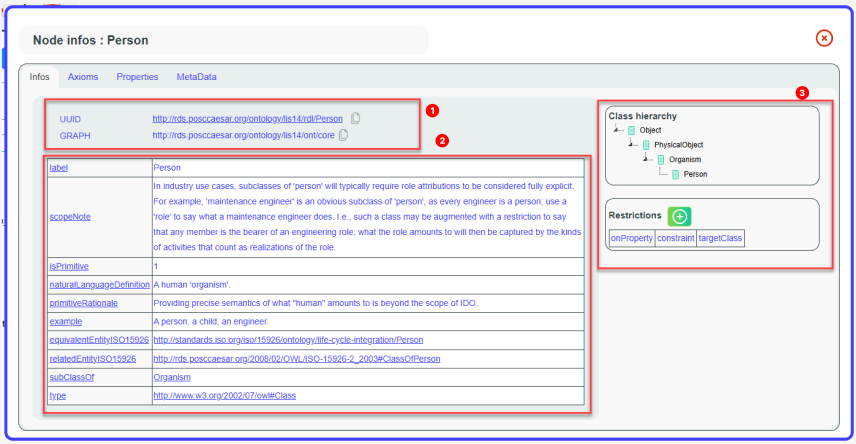

In the first tab, the first section (1) displays the URI of the resource
and the graph URI to which it belongs. The second section (2) lists all
the triples related to the resource. The third section (3) shows all
inheritances of the resource (parents), applicable when the resource is
a class or an individual, along with related restrictions. For
properties, inheritance management is also handled via the
**rdfs:subPropertyOf** property.

There are also different tabs. The **Axioms** tab displays the axioms of
the resource graphically. For detailed documentation, refer to the "Show
Axiom" use case.

The **Properties** tab shows all properties authorized for classes and
individuals, whether the resource is considered as the property range or
the property domain.

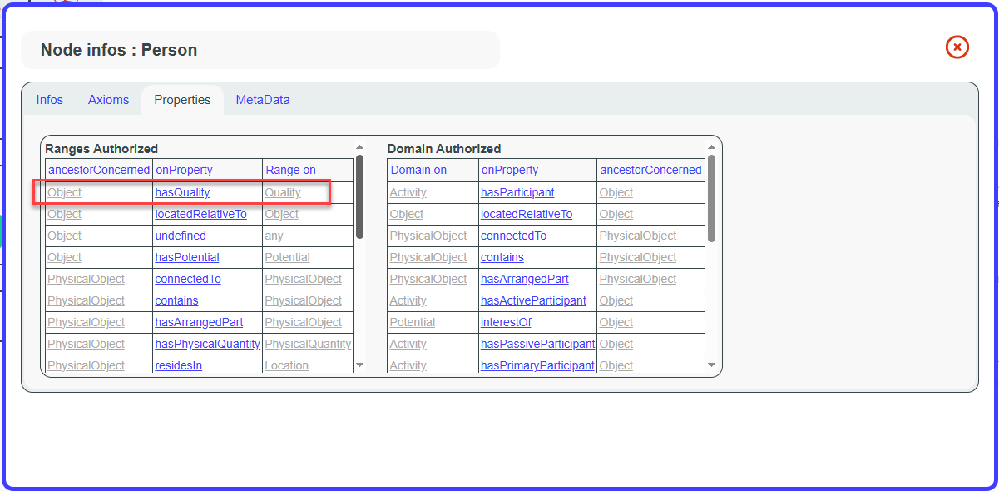

For example, **Person** has **Object** as an ancestor, so we can use the
property **'hasQuality'** from the **Person** node to link to a node
with **Quality** as an ancestor.  
The **MetaData** tab displays the SousLeSens metadata triples. These are
automatically created when you add a new resource through SousLeSens
tools (such as Lineage or MappingModeler).

The concerned properties are listed below:

-   **status**:
    ["https://www.dublincore.org/specifications/bibo/bibo/bibo.rdf.xml#status"](https://www.dublincore.org/specifications/bibo/bibo/bibo.rdf.xml#status)
-   **status**:
    ["https://www.dublincore.org/specifications/bibo/bibo/bibo.rdf.xml#status"](https://www.dublincore.org/specifications/bibo/bibo/bibo.rdf.xml#status)

-   **author**:
    ["http://purl.org/dc/terms/creator"](http://purl.org/dc/terms/creator)
-   **author**:
    ["http://purl.org/dc/terms/creator"](http://purl.org/dc/terms/creator)

-   **provenance**:
    ["http://purl.org/dc/terms/source"](http://purl.org/dc/terms/source)
-   **provenance**:
    ["http://purl.org/dc/terms/source"](http://purl.org/dc/terms/source)

-   **creationDate**:
    ["http://purl.org/dc/terms/created"](http://purl.org/dc/terms/created)
-   **creationDate**:
    ["http://purl.org/dc/terms/created"](http://purl.org/dc/terms/created)

-   **mappingFile**:
    ["http://souslesens.org/KGcreator#mappingFile"](http://souslesens.org/KGcreator#mappingFile)
-   **mappingFile**:
    ["http://souslesens.org/KGcreator#mappingFile"](http://souslesens.org/KGcreator#mappingFile)

### SPARQL 

The **SPARQL** tab, when clicked, launches a bot that guides you in
building a SPARQL query, which will then be displayed on the whiteboard.
The bot's questions are influenced by the content already present on the
whiteboard. This feature is useful for exploring and visualizing
individuals. The bot's questions filter the individuals to prevent an
overwhelming display of results and to keep the results understandable.
You can choose to start from a property or a class to see the
individuals related to your selection.

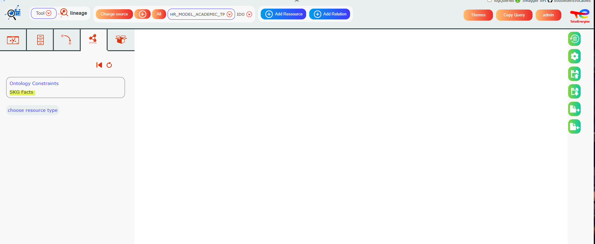

Choose Class

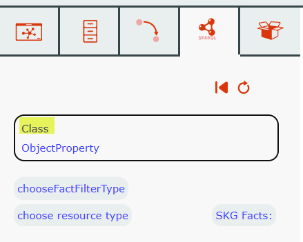

Click on Person , then any

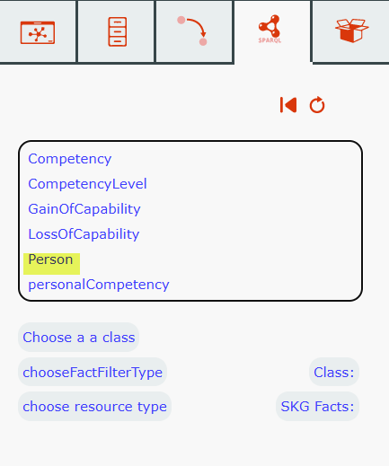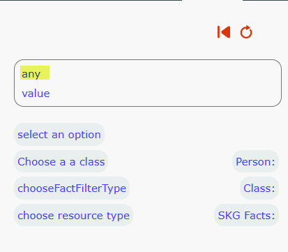

Choose the property that interests you from the **Person** individuals:

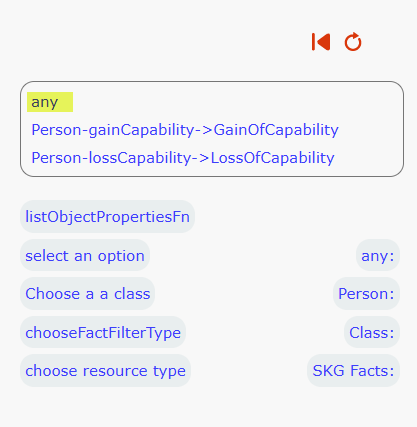

Finally, choose how you would like to receive the output.

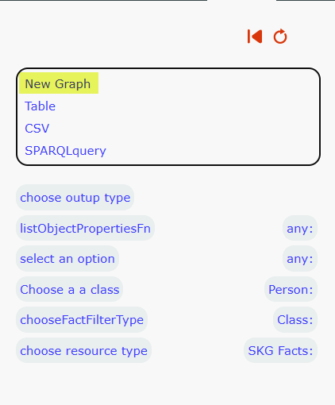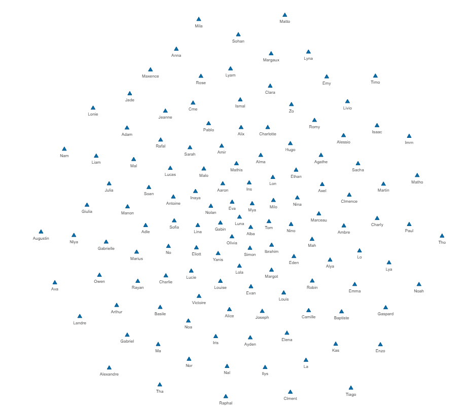

### Axioms and reasoner

In the **IOF-Core** ontology, which contains many axioms, the **Axioms**
tab displays a graphical representation of the axioms associated with a
specific class, grouped by axiom type. The **Show Triples** option
displays the triples corresponding to the displayed axiom.

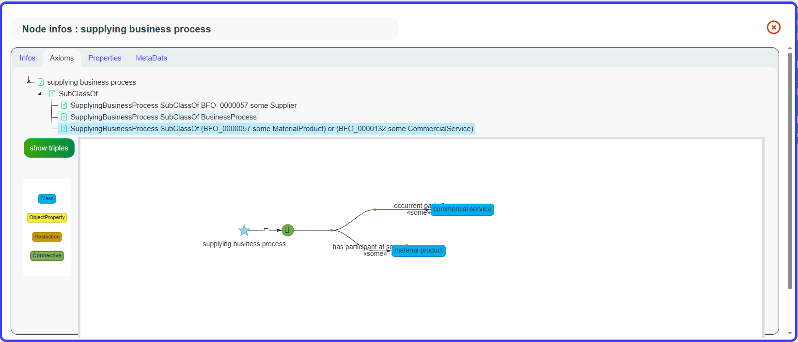

Export buttons are also provided in SVG and GraphML.