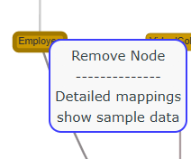
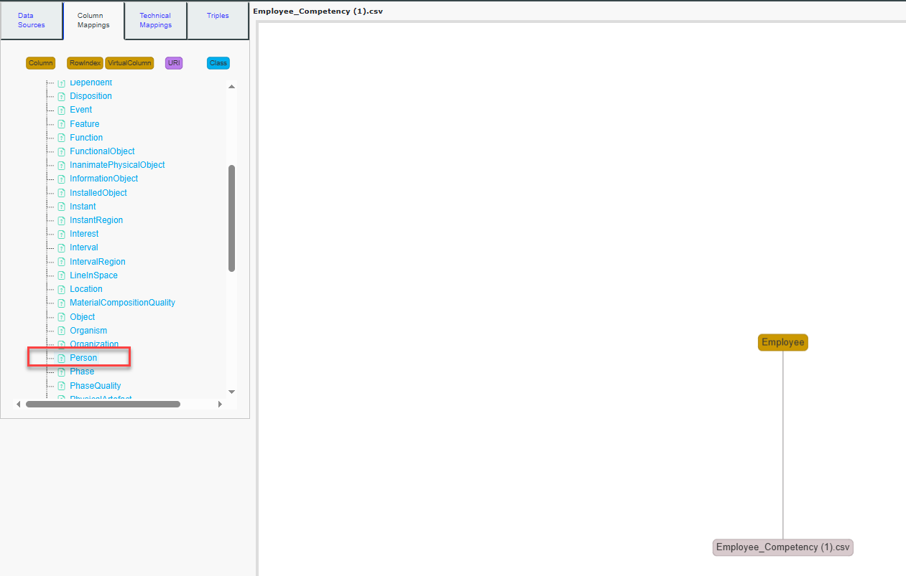
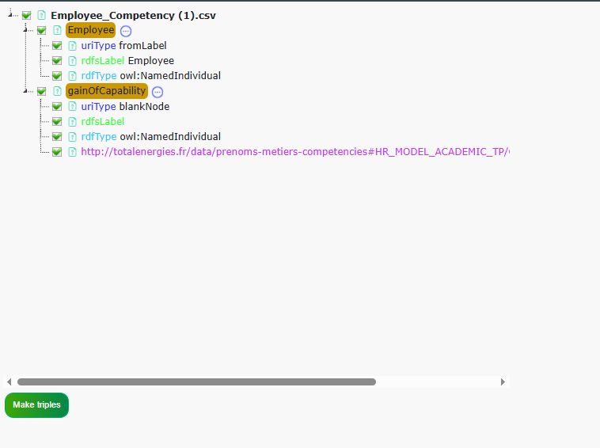

# MappingModeler

The **MappingModeler** tool is one of the main components of
**SousLeSens**, a web application for managing ontologies and knowledge
graphs built around the Semantic Web framework.  
It is designed to create semantic knowledge graphs from SQL database
sources or CSV data.

```{contents} Table of Contents
:depth: 3
```

## UI overview

### Terms

**Source**: The current source launched in the tool. It is displayed in
the top panel.  
**Data Source**: Refers to the original source of data — either a CSV
file or a SQL database connection.  
**Mappings**: Refers to the semantic model created from the data source.
The semantic model consists of **nodes** and **edges** — where nodes
represent ressources, and edges represent properties between them.

**Nodes**

A node can be of four types:

**Class** – Represents a class from an ontology model.

**Column** – Represents a column from the data source and appears in
**orange** on the graph.  
Typically, a column is linked to a class node via an rdf:type relation,
which is the standard semantic link for defining types.

**Virtual Column** – Used to model intermediate or implicit objects that are not explicitly described in the data source. 
It often corresponds to a group of columns whose combination conveys additional information. 
For example, defining a class for a job acquisition event that is implied but not present as a dedicated column.

**Row Index** – Represents an individual row of the dataset. It is
useful when each row carries meaningful information and must be
referenced explicitly.

Edges (or Properties)

An edge can be of two types:

**Object Property** – A relationship between two classes or two
individuals in the graph.  
When creating a relation between two classes, MappingModeler
automatically suggests all suitable properties based on the top
ontology.

**Datatype Property** – An attribute that links a class (or individual)
to a **literal** value (e.g., string, integer, date).  
Datatype properties are not modeled as classes and are only visible in
the *Technical Mappings* view, not in the *Column Mappings* view.

**Literal:**

Represents values such as strings, integers, dateTimes, etc.

**URI (Uniform Resource Identifier)**

Each class uses a URI to uniquely identify its instances. A URI is often
generated using a label column from the data source (e.g., an ID or
name).  
URIs can also be automatically generated (randomIdentifier).  
Alternatively, **blank nodes** (nodes without a URI) are used for
intermediate or auxiliary elements that don’t require a global
identifier.

**URI Type**

Each class has a URI type:

**fromLabel**: The URI is generated from a label column in the data
source.

**blankNode**: The ressource does not have a URI and is represented as a
blank node.

**random Identifier** : The resource has random generated URI

### Global Overview


**The Lineage UI** is structured around three main components:

- **Left Panel** **with four tabs** : *Data Sources*, *Column Mappings*,
  *Technical Mappings*, and *Triples*.

- **Whiteboard**: Provides a visual representation of the mappings and
  allows users to interact with and modify them.

- **Right Panel**: Includes buttons related to the whiteboard, offering
  common actions available across multiple tools.

The **Top Panel** is shared across all tools in the application.
However, its content adapts based on the currently selected tool. For
more information, refer to the *Global Overview* section in the Lineage
user documentation.

### Left Panel : Data Sources Tab


**This panel** displays a tree view of the different data sources in
your project. These sources are grouped by type (CSV files or
databases).

When the **MappingModeler** tool is launched, this tab is shown by
default, allowing you to select a current data source by left-clicking
on it. A current data source must be selected to perform any mapping
actions.

If no data sources are listed in the tree, you can add one by following
the steps in the *Add a Data Source* tutorial section.

### Left Panel : Columns Mappings

**This tab** allows you to perform **structural mappings** by defining
which columns you want to map, their types, and how they are linked.

Once a resource node is mapped, Run Mappings will apply the mappings to
each row of the currently selected data source. **For example**, if you
map the ID column to the Employee column using the rdfs:label property,
then for each row in the ID column:  
- a node will be created using the ID value as its identifier,  
- this node will have the corresponding value from the Employee column
as its label.


1.  **Column button :** : Displays a list of all columns from the
    selected data source in the Search Panel (7). Clicking on a column
    will create a **Column node** on the Mapping whiteboard and display
    the **Class button** (5), which allows you to link the column node
    to a class node (see *Add Column Mappings* for more details).
    Right-clicking opens a menu to view data related to that column.

2.  **Row Index :** Creates a **\# node** representing a row on the
    Mapping whiteboard and displays the **Class button** (5) to link it
    to a class node.


1.  **Virtual Column :** Triggers a pop-up to choose a name for your
    virtual column and creates a virtual column node with the chosen
    name. It also displays the Class button (5), allowing you to link it
    to a class node.

2.  **URI :** Triggers a bot that helps you create a resource column
    with the chosen type in the mappings. When creating a triple
    mapping, all URI columns will create a resource with the selected
    URI.

3.  **Class button :** Displays all classes of the source and its
    imports. Clicking on a class will add it to the mappings. Clicking
    on *Create New Class* will trigger a bot to help you create a new
    class. Right-clicking on a class will present a menu with the option
    to delete the class.

4.  **Search Bar :** Filter the search panel using your keyword.

5.  **Search Panel :** List resources based on the clicked button:
    Display all classes for the "Class" button (5) and all columns for
    the "Column" button (1).

### Left Panel : Technical Mappings

This panel is based on the mappings you’ve done in the **Column
Mappings** tab. It is recommended to visit this tab after completing the
structural mappings with the **Column Mappings** tab. The mapping
whiteboard in this tab differs from the column mappings whiteboard, as
it focuses on representing technical mappings. This tab allows you to
enhance your mappings by adding technical details such as resource
labels, types (Class or Individual), base URI, datatype properties, and
more. For more details, see the tutorial section.


1.  **Ressource nodes Tree:**

All resource nodes defined in the **Column Mappings** (columns, URIs,
virtual columns, and row index) are listed in this tree. For each node,
its technical mappings are displayed below, including details such as
whether they are Individuals or Classes, their labels, URI types, and
datatype properties. By right-clicking a specific technical mapping, you
can delete it.


1.  **Detailed Mapping panel** : This panel displays information about
    the resource node clicked in the **Resource Nodes Tree** (8). It is
    recommended to fill in all the inputs in this panel for each
    resource node, as this will ensure the mappings are complete and the
    knowledge graph can be effectively used by other tools. This panel
    also displays new buttons, which are described below.

2.  **Base URI :**

The base URI used for URI construction of the resource. If the base URI
is empty, the source graph URI will be used instead. See **URI Syntax**
(11) for more details.

1.  **URI syntax :**

> **-fromLabel**: The URI for this resource node will be constructed
> using the Base URI + the row value of the resource.
>
> **-Blank node**: All resources will be assigned blank node URIs with
> the format &lt;\_:b\[randomHexaId\]&gt;.
>
> **-randomIdentifier**: All resources will have the following URI: Base
> URI + randomHexaId.

1.  **Rdf:type :**

Choose whether the resource created will be an **Individual** or a
**Class**. It can also be left empty for specific use cases.

1.  **Rdfs:label :**

> **Columns values** are used to build the labels for this resource
> node. This field can be left empty.

1.  **More mappings button :**

A bot will appear to assist you in adding specific mappings, such as
datatype properties, comments, transformations, and more. The tutorial
provides a detailed explanation of the various possibilities available.

1.  **Save :** Save the values you’ve filled in for the resource nodes

### Left Panel : Triples

This panel provides buttons to run and test the mappings, delete the
triples created by the mappings, or index them so they can be referenced
in other tools.


1.  **View SLS mappings** : The SLS API uses a specific format to
    execute mappings. This button displays the mappings that are sent to
    the server when you run your mappings, based on the data you've
    filled in the MappingModeler.

2.  **View R2ML mappings**: See mappings in R2ML format.

3.  **Show sample triples** : Preview the triples that will be created
    by running your mappings with the current data source.

4.  **Create triples** :

Execute the mappings using your current data source.

1.  **Delete current file triples** : All created mappings will have a
    metadata triple associated with the file name. This action will
    delete all triples containing this metadata.  
    **Warning**: If your resource is shared across multiple files, it
    could be deleted with this button.

2.  **Delete all mapped triples** : Triggers the deletion of all triples
    generated by MappingModeler for current source.

3.  **Recreate graph** : This action deletes all triples previously
    generated by the MappingModeler (see button 21), then automatically
    runs the mappings again for **each data source** defined in your
    project.  
    Useful to refresh the knowledge graph based on updated mappings or
    modified source data.

4.  **Index graph** : This action indexes all triples generated by the
    MappingModeler so they can be referenced and used in search tools
    across the platform. It ensures that your data is discoverable and
    properly linked within other SousLeSens tools.

### Right Panel : Mappings buttons


1.  **Clear all mappings :** Clears all the mappings

2.  **Save Mappings**: Saves mappings

3.  **Load Mappings**: Load saved mappings.

4.  **Display :** Opens a menu to modify the graph display parameters,
    such as spatialization algorithms, node distance, etc.

5.  **Export mappings**: Exports the current mappings whiteboard in
    various formats (GraphML, SVG, CSV, PlantUML, JSON).

6.  **Import mappings** : Allows you to import mappings from a JSON file
    exported by SousLeSens. The file should follow the [vis.js network
    format](https://visjs.github.io/vis-network/docs/network/) with an
    added mappings property specific to SousLeSens. This enables you to
    reload and reuse existing mapping configurations easily.

### Shortcuts

Right-clicking on a node opens a contextual menu with several actions
depending on the node type:

- **For all nodes**:

-Remove from mappings: Deletes the node from the current mappings.

- **For column nodes**:

> -Show sample data: Displays a preview of data from the associated
> column.
>
> \- Detailed mappings: Opens the detailed mapping configuration,
> similar to the panel in the Technical Mappings tab.

- **For class nodes**:

> *-*Node Infos: Opens a window showing detailed information about the
> class node (see Node Infos section in the Lineage user documentation
> for more details).



When you **Ctrl + click** on two nodes, the **Search Panel (7)**
displays a list of properties that are authorized based on **domain and
range** compatibility between the selected nodes.

Clicking on one of these properties will **create a semantic link**
between the two nodes using the selected property.

When you right click on the **Detailed Mapping Tree**, you’ll get
different options depending on the type of mapping selected:

- **For all mappings**:  
  – *Delete* a specific mapping.

- **For specific mappings** such as *Transforms*, *Lookups*, or
  *Functions*:  
  – *Edit value* to modify the content or behavior of the mapping.


## Tutorial

Let’s open the Mapping Modeler tool in SousLeSens, and select the source
HR\_MODEL\_ACADEMIC\_TP source.


Now, the **Mapping Modeler** tool opens.  
Right-click on the **csvSources** section in the Data Sources tree, then
add the following **CSV source**.  
A file selection window will appear, select your CSV file to import them
into your source.


 

Your file is now imported into the **Mapping Modeler** tool and appears
in the data source tree.  
Click on it to select it as the **current data source**, so you can
start defining mappings on it.


When you click on it, the **Column Mappings** tab automatically opens
and lists all the columns from your file.  
Now, click on **Employee**.

The **column node "Employee"** will now appear on the mappings graph.  
Next, click on **Person** to link the **Employee** column node to the
**Person** class node.

Your mappings whiteboard should now appear as illustrated in the
image.

**Now, let’s create a virtual column node named gainOfCapability.**  
Click on the **Virtual Column** button, then enter gainOfCapability in
the popup that appears. A new node named **GainOfCapability** will be
added to the mappings whiteboard.

**Note:**

- Virtual columns appear as **orange squares**.

- Regular column nodes appear as **orange rectangles**.

- Class nodes are displayed as **blue rectangles**.


**After creating the virtual column**, the search panel will list
available classes to link it to. Since no class corresponds, we will
create a new one.  
Click on ***Create new Class***. A bot popup will appear.  
Fill in the **Label** field with GainOfCapability, and set it as a
**subClass of** IDO:Activity..


The new class is added to the tree. Click on it to select it.Your
mappings whiteboard should now appear as illustrated in the image.

 

Now, Ctrl+Click on "Employee" and then Ctrl+Click on "gainOfCapability."
Authorized properties based on ranges and domains to link both nodes
will be displayed on search panel. We can see that "participantIn" is a
semantic match, but we want to be more specific and use the property
"gainsCapability" to link the nodes. To do this, we will add a new
Object Property by clicking on "\_Create new
ObjectProperty."

Then, a bot will appear. Fill in the label with "gainsCapability" and
set it as a subProperty of "IDO:participantIn."

 


The new property will now appear, and you can select it. Once selected,
the link between the two nodes will be created.

 

You can directly select *participantIn* or another property from this
menu if needed. Now, let's add the technical details necessary to
properly run the mappings.

Select the *Technical Mappings* tab. The mappings whiteboard will
display the mappings in a more technical and exhaustive way


To run the mappings, we now need to fill in the basic technical mappings
so that the SLS API has the necessary information to execute the
mappings correctly.

To begin, click on *Employee*.


The detailed mapping panel (9) will appear. The URI syntax will be set
to *fromLabel*, meaning that for each specific value in the Employee
column, the URI created will be the baseURI (equivalent to graphURI if
not filled) + the cell value.

For example, if the first row value of the Employee column is "Peter",
the URI created will be:
http://totalenergies.fr/data/prenoms-metiers-competencies#HR\_MODEL\_ACADEMIC\_TP/Peter

The values in the Employee column represent Individuals of the Person
class, meaning each value is an instance of the Person class. In this
case, we fill the *rdf:type* as *owl:NamedIndividual* because Peter is
an instance of the Person class.

For each Employee value, the label will be the value itself. So, for
example, Peter’s label will be "Peter". Therefore, we fill *rdfs:label*
with the value of Employee.

Note that the label is not always directly in the column itself. For
example, we could build the URI from an ID column, and the label could
come from the Employee column.

Once these mappings are filled in, you can save your changes by clicking
on Save.


The detailed mappings for the Employee column will be set like
this.

You can modify the detailed mappings for the Employee column at any time
by clicking on it again and updating the information as needed. You can
also delete a specific detailed mapping by right-clicking on it.

Now, let's proceed with the same process for the **gainOfCapability**
virtual column. Click on it to access its detailed mapping panel.

Since gainOfCapability is a virtual column, it does not have cell values
directly associated with it. The purpose of this virtual column is to
make explicit the concept that a person will gain a competency over
time. This information is implicit in the CSV file but needs to be
represented explicitly in the semantic knowledge graph.

\- **Blank Nodes**: For virtual columns, it is recommended to use
**blank nodes**. Blank nodes are typically used for intermediary
resources, which is the case for gainOfCapability. By definition,
virtual columns are intermediary nodes and thus benefit from being
represented as blank nodes.

\- **Individuals**: For each row, the **gainOfCapability** event (e.g.,
when a person gains a new competency) will be an instance of the
**gainOfCapability** class.For example, if Peter gains a new competency,
that specific event is considered an instance of the
**gainOfCapability** class.

\- **rdfs:label**: Since the event represented by **gainOfCapability**
does not have a direct name in the data (as it's implicit), the
**rdfs:label** is not filled in for this virtual column.


Once you have filled these details, you can save the mappings for the
**gainOfCapability** virtual column.Here the detailed mappings.


To describe the event of the **gain of capability** along with the
**start date** in our knowledge graph, we need to link the
**gainOfCapability** event with a **dateTime** information. This can be
done by creating a new **Datatype Property**.

Click on the **gainOfCapability** virtual column in the detailled
mappings tree to select it.

After selecting the **gainOfCapability** virtual column, you should see
the option **More Mappings**. Click on it. This will open additional
options for detailed mappings.

Once you click on **More Mappings**, you’ll be able to see more detailed
configuration options to enrich your mapping process.


Click on **Create Datatype Property**


Set the label ‘gainOfCapabilityDate’ for our datatype property.


Select xsd:dateTime


Our datatype property is now created. We will associate it with our
virtual column. Click again on ‘moreMappings


Then on add predicate.


Then select HR\_MODEL\_ACADEMIC\_TP


And your new added datatype property


Select it as a dateTime with the **FR format**, using the values from
the **startDate** column.  
*(Make sure to choose the correct format based on how dates appear in
your data column.)*


Your date has been successfully added to your
mappings.

Our mappings are now complete. You can preview the triples that will be
generated.  
To do this, go to the **Triples** tab and click on **Show Sample
Triples**.


A tree will appear displaying all your mappings. You can select a
specific subset from this tree to run your mappings only on the selected
elements.



You can leave all items checked, then click on **Make Triples**.


A table listing a sample of the generated triples will be displayed. We
can now analyze the information in relation to our original dataset.

For example, let's take the row corresponding to the employee *Yanis* in
our data sheet.


We can see that the data describes *Yanis* as having three rows, each
corresponding to a different competency he acquired, with distinct
acquisition dates.

To explore this further, search for *Yanis* in the **Show Sample
Triples** table.


We observe that *Yanis* is defined as an individual of type *Person*,
with the label *Yanis*. This reflects the detailed mappings we
previously configured, where:

- The **URI** is generated using the Employee column value (*Yanis*),

- The **rdf:type** is set to owl:NamedIndividual,

- The **rdfs:label** is set using the Employee column as well.


We also see that he gains **3 capabilities**, corresponding to the **3
rows** in the data sheet.

This is the result of the mapping where:

- The **Employee** node is linked to the **gainOfCapability** virtual
  column using the gainsCapability object property.

- Each row creates a new instance (a blank node) of the
  **gainOfCapability** class.

- The **gainsCapability** property connects *Yanis* to each of these
  capability gain events.


We can now search for **one capability acquired by Yanis** in the sample
triples table, to view the corresponding triple.


We can see that this capability is represented as a blank node due to
its URI pattern. Additionally, we observe that it is of type
**individual** and **gainOfCapability**.


We can also see the datatype property we added, linking the
gainOfCapability event to the corresponding **startDate** value in the
data.

After verifying the mappings using the show sample triples preview, you
can create the triples on the source by clicking the **Create triples**
button in the **Triples** tab.

### Add Data source: Databases

To import data for creating a knowledge graph from a database, you need
to contact an administrator to configure your database in the **Config
Editor** tool.


Then, go to the **Mapping Modeler** tool, open the **Data Sources** tab,
right-click on **Database Sources**, and select your New Database name.


Once your database is added, it should appear in the **Database Source
Tree**. Click on one of the database table to set it as the current data
source for mapping.

### Import classes

If you have a data source containing two columns, each representing a
class, and you want to create classes from this file


An asset is a class, and an element is a subclass of this asset, also
defined as a class. For example, an AI model is a Business Asset, and
both are classes.

To do this, select the Column Mappings tab, then click on
Asset.

Do not select a class from the search panel. Instead, click again on the
Column button, and then choose Element.


Ctrl + click on Element, then Ctrl + click on Asset, and choose
rdfs:subClassOf.


Then select the Technical Mappings tab. For both of them, designate them
as owl:Class for rdf:type, fromLabel for URI syntax, and set their
rdfs:label to themselves.


After filling out and saving both, here are the detailed mappings.


Preview the results by selecting the Triples tab and clicking on 'Show
Sample Triples'.

The class triples will be generated along with their
hierarchy

### Add transform 

Transforms allow you to apply JavaScript functions to each row of a
column.

For example, in our tutorial source HR\_MODEL\_ACADEMIC\_TP, we want to
add a prefix to the URI by adding 'employee-' before each label for
better clarity.

To do this, select the Technical Mappings tab, then choose Employee and
click on 'More Mappings'.


A pop-up will appear. Click on 'Prefix URI' and fill the pop-up with
'Employee:'.


A JavaScript function will be auto-filled with instructions for
prefixing the URI. If you click on 'Test,' you will see a sample of the
triples produced with the added transform.

All Employee URIs are now prefixed with 'Employee-'. Transforms can
handle multiple transformations using JavaScript. The JavaScript
function will be applied to all SLS mappings related to the column. To
view the SLS mappings, go to the Triples tab and click on 'View SLS
Mappings.'


The SLS API for triple construction will apply the JavaScript function
to each value in the column and for each mapping related to that column.


The parameters of this function will be as follows:

- **Value**: The value of the column (e.g., the values from the Employee
  column).

- **Role**: The role of the current SLS mapping for the Employee column,
  either as Subject(s), Predicate(p), or Object(o).

- **Prop**: The property used in the current SLS mapping (useful for
  applying transforms only with specific property values).

- **Row**: The current row (e.g., row\[‘Col1’\] provides the value of
  col1 in the current row).

- **Mapping**: The current SLS mapping.

You can edit or delete a transform by right-clicking it in the detailed
mapping tree.


### Add Lookup

Lookup replaces a column value with the value from another column, which
can be from a different data source. Given the following data
sheet.

The **CFIHOSUniqueCode** column provides a unique code for each
**tagClassName** value. However, the **parentTagClassName** column does
not have a code associated with it. A **Lookup** operation will fix this
by, for each **parentTagClassName** value, finding the corresponding row
in the **tagClassName** column and assigning the corresponding
**CFIHOSUniqueCode** value from the matching row.

For example, if the **parentTagClassName** is **actuator**, the lookup
will search for the **tagClassName** with the value **actuator** and
replace each occurrence of **actuator** in **parentTagClassName** with
**CFIHOS-30000607** (the corresponding **CFIHOSUniqueCode** for that
tagClassName).


This lookup action can be applied to another data source. It can also be
used exclusively for the column acting as the subject, the column acting
as the object, or both.

To add a lookup, first select the column that will be replaced by the
lookup in the Technical Mappings tab, then click on **more mappings**.


Then add Lookup


Then choose file containing the common values with your column (in this
example tagClassName)


Choose the column containing the common values.


Choose the target column where the values of your column will be
replaced by the values from this column.


Select whether the lookup (value replacement) will be applied when the
chosen column (parentTagClassName) is used as the subject, the object,
or both in the mapping.


The lookup is now saved. You can edit or remove it by right-clicking on
it in the detailed mapping tree.


Here are the resulting triples for this lookup. (show sample triples).


The URIs now correctly use the CFIHOS codes obtained through the lookup,
while the rdfs:label—in cases where parentTagClassName is used as an
object—still reflects the original column values.

### Use column as property for triples

Work in progress